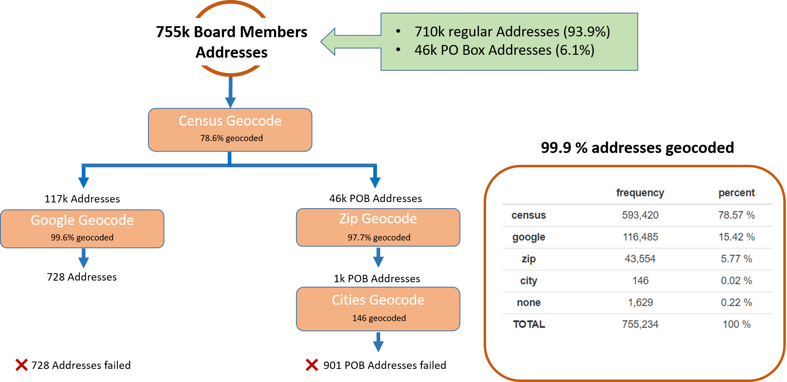
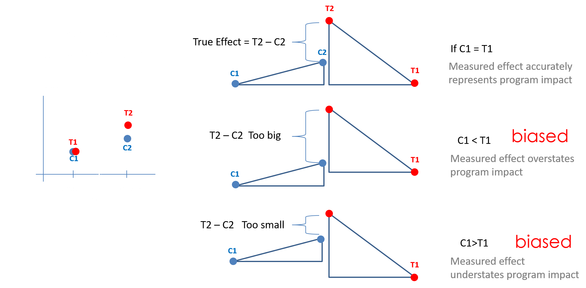
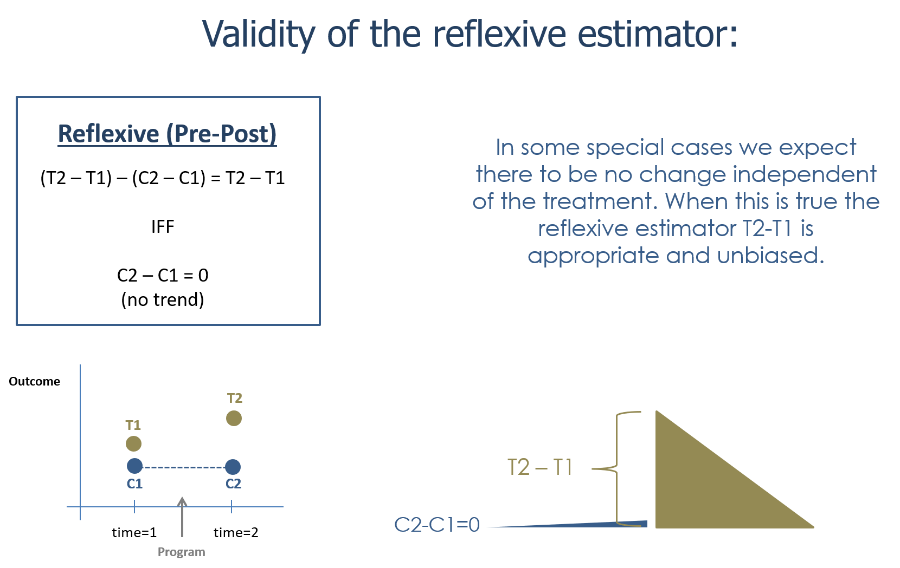

```{r setup, include=FALSE}
knitr::opts_chunk$set( echo=TRUE, message=F, warning=F, eval=T, fig.width=10 )
```


```{r}
library( dplyr )
library( knitr )
library( pander )
library( stargazer )
library( scales )
library( ggplot2 )
library( gridExtra )

set.seed( 1234 )

# set stargazer type to text for 
# previewing in RMD docs but
# convert to type HTML when knitting
# (next code chunk)

s.type <- "text"  
```


```{r, echo=T}
###################################
#
#     STARGAZER SETTINGS
#
###################################

# DO NOT RUN CHUNK UNLESS KNITTING:
# changes table formats to html
# before rendering RMD docs

s.type <- "html"
```


# Overview

This last step in your project will walk you through adding data from two federal programs designed to help low-income


**About the NMTC Program**

The NMTC Program enables economically distressed communities to leverage private investment capital by providing investors with a federal tax credit. All NMTC investments must meet statutory qualifications for their investors to be able to claim the tax credit. The vast majority of NMTC investments are made within statutorily defined “Low-Income Communities.” Low-Income Communities are census tracts with a poverty rate of 20 percent or greater, or a median family income at or below 80 percent of the applicable area median family income. In addition to investments located in Low-Income Communities, investments can qualify for NMTCs by using other statutory provisions designed to target certain areas or populations, including provisions for Rural Counties, and Low-Income Targeted Populations.

Through the first 15 application rounds of the NMTC Program, the CDFI Fund has made 1,178 awards, allocating a total of $57.5 billion in tax credit authority to CDEs through a competitive application process. 

[data download website](https://www.cdfifund.gov/news-events/news/Pages/news-detail.aspx?NewsID=364&Category=Press%20Releases)


**About the LIHTC Program**

The Low-Income Housing Tax Credit (LIHTC) is the most important resource for creating affordable housing in the United States today. The LIHTC database, created by HUD and available to the public since 1997, contains information on 47,511 projects and 3.13 million housing units placed in service between 1987 and 2017.

[data download website](https://lihtc.huduser.gov/)


# Data

Load your wrangled datasets and prepare your variables for analysis:


```{r}
d1 <- readRDS( "data/rodeo/LTDB-2000.rds" )
d2 <- readRDS( "data/rodeo/LTDB-2010.rds" )
md <- readRDS( "data/rodeo/LTDB-META-DATA.rds" )

d1 <- select( d1, - year )
d2 <- select( d2, - year )

d <- merge( d1, d2, by="tractid" )
d <- merge( d, md, by="tractid" )
```


## Add Federal Data


```{r}
URL1 <- "https://raw.githubusercontent.com/DS4PS/cpp-528-spr-2020/master/labs/data/raw/NMTC/nmtc-sheet-01.csv"
nmtc <- read.csv( URL1, stringsAsFactors=F )
head( nmtc ) 

URL <- "https://raw.githubusercontent.com/DS4PS/cpp-528-spr-2020/master/labs/data/raw/LIHTC/LIHTCPUB.csv"
lihtc <- read.csv( URL, stringsAsFactors=F )
head( lihtc )

# remove anything not a number from the string
d$id2 <- gsub( "[^0-9]", "", d$tractid )
head( d$id2 )


# check NMTC census tract IDs

length( unique( nmtc$X2010.Census.Tract ) )
length( intersect( nmtc$X2010.Census.Tract, d$id2 ) )

# fix IDs so they are match
d$id2 <- as.numeric( d$id2 )

length( intersect( nmtc$X2010.Census.Tract, d$id2 ) )
# all but 13 of projects have a matched census tract 


# check LIHTC census tract IDs

length( unique( lihtc$fips2010 ) )
length( intersect( lihtc$fips2010, d$id2 ) )

# all but 62 projects out of 21,000 have a matched census tract 
```


## Aggregate Fed Data

We can't merger the dataset directly because there are multiple projects per census tract. We need to aggregate the project data first: 

**LIHTC:**

```{r}
lihtc.dollars <-
  lihtc %>% 
  filter( yr_alloc >= 2000 & yr_alloc <= 2010 ) %>%
  group_by( fips2010 ) %>%
  summarize( num.lihtc = n(), lihtc.total = sum( allocamt, na.rm=T ) )

head( lihtc.dollars )
```

**NMTC:**

```{r}
# need to convert from currency to numeric
# current format: 
# head( nmtc$QLICI.Amount )
# [1] "$300,000.00 "   "$1,008,750.00 " "$977,000.00 "

# remove dollar sign and commas
nmtc$amount <- gsub( "[,$]", "", nmtc$QLICI.Amount )

# head(  nmtc$amount  )
# "300000.00 "  "1008750.00 " "977000.00 "

# convert characters to numeric 
nmtc$amount <- as.numeric( nmtc$amount ) %>% round(0)

# head(  nmtc$amount  )
# [1]  300000 1008750  977000

nmtc.dollars <- 
  nmtc %>% 
  filter( Origination.Year >= 2000 & Origination.Year <= 2010 ) %>%
  group_by( X2010.Census.Tract ) %>% 
  summarize( num.nmtc=n(), nmtc.total = sum( amount, na.rm=T ) )

head( nmtc.dollars )
```


## Merge Census and Tax Policy Data

```{r}
d <- merge( d, nmtc.dollars, by.x="id2", by.y="X2010.Census.Tract", all.x=T )
d <- merge( d, lihtc.dollars, by.x="id2", by.y="fips2010", all.x=T )

# recode tracts that had no grants from NA to 0

d$num.nmtc[ is.na(d$num.nmtc) ] <- 0
d$nmtc.total[ is.na(d$nmtc.total) ] <- 0

d$num.lihtc[ is.na(d$num.lihtc) ] <- 0 
d$lihtc.total[ is.na(d$lihtc.total) ] <- 0
```


## Remove Rural Districts

```{r}
table( d$urban )
d <- filter( d, urban == "urban" )
```


How many tracts receive one or both programs: 

```{r}
# total number of tracts: 59,722
length( unique( d$tractid ) )

sum( d$num.lihtc > 0 )
sum( d$num.nmtc > 0 )
sum( d$num.lihtc > 0 & d$nmtc > 0 ) 
```


## Create New Variables

```{r}
# pro tip when getting started
# and exploring a lot of variables
# while making changes to your dataset:

d.full <- d  # keep a copy so you don't have to reload 
```


You will want to create more variables, but these examples will get you started. 


```{r}
d <- d.full 

# adjust 2000 home values for inflation 
mhv.00 <- d$mhmval00 * 1.28855  
mhv.10 <- d$mhmval12

# change in MHV in dollars
mhv.change <- mhv.10 - mhv.00


# drop low 2000 median home values
# to avoid unrealistic growth rates.
#
# tracts with homes that cost less than
# $10,000 are outliers
# approximately 200 out of 59,000 cases 
sum( mhv.00 < 10000 ) 
mhv.00[ mhv.00 < 10000 ] <- NA

# change in MHV in percent
mhv.growth <- 100 * ( mhv.change / mhv.00 )
summary( mhv.growth )


d$mhv.00 <- mhv.00
d$mhv.10 <- mhv.10
d$mhv.change <- mhv.change
d$mhv.growth <- mhv.growth 


d <- select( d, 
             
             tractid, cbsa, cbsaname,            # ids / units of analysis
             
             mhv.00, mhv.10, mhv.change, mhv.growth,    # home value 
             
             hinc00, hu00, own00, rent00,        # ses
             hinc12, hu10, own10, rent10,
             
             empclf00, clf00, unemp00, prof00,   # employment 
             empclf12, clf12, unemp12, prof12,
             
             dpov00, npov00,                     # poverty
             dpov12, npov12,
             
             ag25up00, hs00, col00,              # education 
             ag25up12, hs12, col12,
             
             pop00.x, nhwht00, nhblk00, hisp00, asian00,   # race
             pop10, nhwht10, nhblk10, hisp10, asian10,
             
             num.nmtc, nmtc.total,              # tax policy data
             num.lihtc, lihtc.total             # aggregated by census tract
             
          ) # end select


d <- 
  d %>%
  mutate( 
          # 2000 variables
          p.white.00 = 100 * nhwht00 / pop00.x,
          p.black.00 = 100 * nhblk00 / pop00.x,
          p.hisp.00 = 100 * hisp00 / pop00.x, 
          p.asian.00 = 100 * asian00 / pop00.x,
          p.hs.edu.00 = 100 * (hs00+col00) / ag25up00,
          p.col.edu.00 = 100 * col00 / ag25up00,
          p.prof.00 = 100 * prof00 / empclf00,
          p.unemp.00 = 100 * unemp00 / clf00,
          pov.rate.00 = 100 * npov00 / dpov00,
          
          # 2010 variables
          p.white.10 = 100 * nhwht10 / pop10,
          p.black.10 = 100 * nhblk10 / pop10,
          p.hisp.10 = 100 * hisp10 / pop10, 
          p.asian.10 = 100 * asian10 / pop10,
          p.hs.edu.10 = 100 * (hs12+col12) / ag25up12,
          p.col.edu.10 = 100 * col12 / ag25up12,
          p.prof.10 = 100 * prof12 / empclf12,
          p.unemp.10 = 100 * unemp12 / clf12,
          pov.rate.10 = 100 * npov12 / dpov12 )

# inflation adjust income 
d$hinc00 <- 1.28855 * d$hinc00

d <-
  d %>%
  group_by( cbsaname ) %>%
  mutate( # metro rank of home value in 2000
          metro.mhv.pct.00 = ntile( mhv.00, 100 ),
          # metro rank of home value in 2010
          metro.mhv.pct.10 = ntile( mhv.10, 100 ),
          # median pay for metro area 2000
          metro.median.pay.00 = median( hinc00, na.rm=T ),
          # median pay for metro area 2010
          metro.median.pay.10 = median( hinc12, na.rm=T ),
          # tract rank in metro area for diversity (% non-white)
          metro.diversity.rank.00 = ntile( (100-p.white.00), 100 ),
          # metro total population 2000
          metro.pop.total.00 = sum( pop00.x, na.rm=T ),
          # metro total population 2010
          metro.pop.total.10 = sum( pop10, na.rm=T ) ) %>%
  ungroup() %>%
  mutate( # change in relative rank of mhv in metro area 2000-2010
          metro.mhv.pctile.change = metro.mhv.pct.10 - metro.mhv.pct.00,
          # growth in ave pay in metro
          metro.pay.change = metro.median.pay.10 - metro.median.pay.00,
          # metro population growth 2000-2010
          metro.pop.growth = ( metro.pop.total.10 - metro.pop.total.00 ) / metro.pop.total.00,
          # increase in the proportion of whites in tract 
          increase.p.white = p.white.10 - p.white.00  )

```


 
## Rodeo Dataset

Now that you have merged all of your datasets, this is a good place to save your **rodeo dataset** - the version you will use in your models. 

It is helpful because you will often spend a lot of time on model specification and it's super helpful to bypass all of the data steps and load a version that is ready for analysis. 

As you organize the project, try to keep the data steps and analysis separate. We have combined them in these labs for continuity, but in practice it should be something like: 

```
data steps 
|
|--clean and merge data 
|--create new variables
|--save as research (rodeo) database
    |
    |--load for descriptive analysis (first chapter in analysis)
    |--load for inferential analysis (second chapter in analysis)
```

You might have multiple sections or "chapters" depending upon how complex your analysis is and how much sensitivity analysis you do. But all of them would start by loading the rodeo dataset. 

Variable transformations are a little tricky. If they are nuanced variables, like aggregating change at multiple levels, I would do it once as part of the data steps. Especially if they are operations that might be easy to screw up, thus introducing error into your dataset. Keeping them as a distinct step let's you run sanity checks like changes in sample size, descriptive stats before and after variable transformations, and printed previews of datasets. That makes it possible for you to save the file, put it away for a couple of days, then review it before sending the final report with fresh eyes. Or else have a team member review your work. 

For other variable transformations like log transformations, scaling units (multiply proportions by 100, dividing GDP by millions, etc.), or recoding factor levels can happen as part of modeling. When creating models you will try hundreds of iterations, so you want to keep records in your analysis files. It is a pain to have to go back to the data steps, recompile, save a new rodeo dataset, then reload. 

So you can include some variable transformations in your analysis files, but try to be judicious so that it is easy to find data steps when you need them. Ask yourself, if someone asked a question about how I created the variable, would I be able to quickly find the code for that step? Do I know where to look? 


<br>
<hr>
<br>


## Data Manifest


It is not common practice, but it is best practice, to keep track of every observation in your dataset so you know exactly how the sample has been altered between your raw data and the final models. 

You can see through the script that we have already dropped 20,000 tracts that are located in rural districts and tracts that have 2000 home values below \$10,000.

Cases can fall out during merges, can be dropped as outliers, or can disappear mysteriously from your dataset. 


This is not a perfect example because it is documenting how specific addresses are geocoded in a database (we had to use different methods for different kinds of addresses), but the main point still stands - if we failed to accurately locate a large proportion of addresses, or if we had to code a lot using assumptions (matching to zip code centroids instead of address locations because of missing info) it could change the nature of our data. Having a record of the process allows you and your audience to understand how the data is created:

<br>
<hr>
<br>



<br>
<hr>
<br>

I find that if I am reading a report that does not clearly describe the process used to create the final model, the authors are often not paying attention to the process. Which often suggests that they were not careful in constructing the sample used in the model from the raw sample. Which means there is a good chance that they have introduced bias into the analysis through the process. 

When creating your data manifest I recommend starting with the raw dataset (how many Census tracts do we have in 2010 in the US?), then write down the sample size in your final model, then build to table to describe how you got from A to B. 

This table is also extremely useful when you need to run sensitivity analysis on your models. Can you justify each step as something that improves the internal validity of your model? Or does it simply increase the chances of finding significant results (p-value hacking)? How sensitive is your model to each step? If you include outliers, for example, are your results consistent? Are there any assumptions we are making about the data that need to be tested? 

Note that outliers often represent a small proportion of cases but can account for a large proportion of the outcome. If we decide to omit millionaires and billionaires from our tax dataset because they are outliers, then calibrate our tax policy, we might be missing the obvious fact that wealthy individuals might be a minority of citizens but contribute a large proportion of tax revenues (maybe not, they are pretty good at tax evasion, but you get the idea). 


<br>
<hr>
<br>


# Descriptives 


**Median Home value**


```{r}

us.median <- paste0( "$", round( median( mhv.00/1000, na.rm=T ), 0 ), "k" )

hist( mhv.00, breaks=200, xlim=c(0,500000), 
      col="gray20", border="white",
      axes=F, 
      xlab=paste0( "MHV (median = ", us.median, ")" ),
      ylab="",
      main="Median Home Value in 2000 (2010 US dollars)" )

axis( side=1, at=seq(0,500000,100000), 
      labels=c("$0","$100k","$200k","$300k","$400k","$500k") )

abline( v=median( mhv.00, na.rm=T ), col="orange", lwd=3 )
```


**Descriptives** 


```{r, results="asis"}

df <- data.frame( MedianHomeValue2000=mhv.00, 
                  MedianHomeValue2010=mhv.10, 
                  MHV.Change.00.to.10=mhv.change,
                  MHV.Growth.00.to.12=mhv.growth )

stargazer( df, 
           type=s.type, 
           digits=0, 
           summary.stat = c("min", "p25","median","mean","p75","max") )
```


**Change in MHV 2000-2010**


If a home worth \$10 million increased in value by \$100k over ten years it would not be that surprising. If a home worth \$50k increased by \$100k over the same period that is a growth of 200% and is notable. 

The change in value variable only reports absolute change, but does not provide a sense of whether that is a big or small amount for the census tract. 

```{r, fig.height=6}
hist( mhv.change/1000, breaks=500, 
      xlim=c(-100,500), yaxt="n", xaxt="n",
      xlab="Thousand of US Dollars (adjusted to 2010)", cex.lab=1.5,
      ylab="", main="Change in Median Home Value 2000 to 2010",
      col="gray20", border="white" )

axis( side=1, at=seq( from=-100, to=500, by=100 ), 
      labels=paste0( "$", seq( from=-100, to=500, by=100 ), "k" ) )
        
mean.x <- mean( mhv.change/1000, na.rm=T )
abline( v=mean.x, col="darkorange", lwd=2, lty=2 )
text( x=200, y=1500, 
      labels=paste0( "Mean = ", dollar( round(1000*mean.x,0)) ), 
      col="darkorange", cex=1.8, pos=3 )

median.x <- median( mhv.change/1000, na.rm=T )
abline( v=median.x, col="dodgerblue", lwd=2, lty=2 )
text( x=200, y=2000, 
      labels=paste0( "Median = ", dollar( round(1000*median.x,0)) ), 
      col="dodgerblue", cex=1.8, pos=3 )
```


**Percent Change in MHV 2000 to 2010**

The percent change variable provides some context for growth rates of value in census tracts. 

Plot the percent change variable:

```{r, fig.height=6}
hg <-
hist( mhv.growth, breaks=5000, 
      xlim=c(-100,200), yaxt="n", xaxt="n",
      xlab="", cex.main=1.5,
      ylab="", main="Growth in Home Value by Census Tract 2000 to 2010",
      col="gray40", border="white" )

axis( side=1, at=seq( from=-100, to=200, by=50 ), 
      labels=paste0( seq( from=-100, to=200, by=50 ), "%" ) )

ymax <- max( hg$count )
        
mean.x <- mean( mhv.growth, na.rm=T )
abline( v=mean.x, col="darkorange", lwd=2, lty=2 )
text( x=100, y=(0.5*ymax), 
      labels=paste0( "Mean = ", round(mean.x,0), "%"), 
      col="darkorange", cex=1.8, pos=4 )

median.x <- median( mhv.growth, na.rm=T )
abline( v=median.x, col="dodgerblue", lwd=2, lty=2 )
text( x=100, y=(0.6*ymax), 
      labels=paste0( "Median = ", round(median.x,0), "%"), 
      col="dodgerblue", cex=1.8, pos=4 )
```


# Program Participation Criteria 

Not all Census tracts are eligible for both programs. The New Market Tax Credit program, in particular, is trying to attract private investment in Census tracts that are considered high-risk because of their current conditions. The tax credits support activities like real-estate projects, small business loans, or building rehab that would traditionally be too expensive or too risky without subsidies (in theory). 

The real challenging part about this sort of program is there are some neighborhoods that community developers should not be working in because the investments are not sustainable. You don't want to incentivize those sorts of investments because they tie up capital in projects that are not sustainable, they raise hopes for the community then let them down, and they waste government resources. 

Alternatively, there are tracts that would have been lucrative investments without the tax credits. If there are enough of these (maybe the economy is going through a long period of expansion so investors have extra capital that they need to invest), then all of the program funds might be captured by projects that would have happened without the nudge. The program is just padding the margins for developers, but not catalyzing any new growth. 

And then there are the goldilocks cases where the community is a pretty good investment, but not lucrative enough to attract purely private sector actors. The tax credits are just enough to offset some of the risks, and projects will happen that would not have without the program. 

If you are too narrow in the qualification criteria you could end up in the first scenario (too many unsustainable investments in unstable communities, thus low impact). If you are too broad you can end up in the second secenario (tax credits supporting investments in stable neighborhoods that would have attracted capital without the program). The best case is a criteria that results in the most grants in the third scenario - sustainable projects that would not have happened without the tax credits.

The fact that private investors have a lot of capital in the projects ensures that they are not simply taking free government money. The tax credits are typically claimed after they spend the money in the community, and thus are invested in projects that they need to be successful to generate a profit. So some incentives are aligned. 

The program participation criteria define which census tracts are eligible, and will greatly shape where the program dollars (tax credits) are allocated. 


**About the NMTC Program**

From the website: 

*The NMTC Program enables economically distressed communities to leverage private investment capital by providing investors with a federal tax credit. All NMTC investments must meet statutory qualifications for their investors to be able to claim the tax credit. The vast majority of NMTC investments are made within statutorily defined “Low-Income Communities.” Low-Income Communities are census tracts with a poverty rate of 20 percent or greater, or a median family income at or below 80 percent of the applicable area median family income. In addition to investments located in Low-Income Communities, investments can qualify for NMTCs by using other statutory provisions designed to target certain areas or populations, including provisions for Rural Counties, and Low-Income Targeted Populations.*

*Through the first 15 application rounds of the NMTC Program, the CDFI Fund has made 1,178 awards, allocating a total of $57.5 billion in tax credit authority to CDEs through a competitive application process.* 

[data download website](https://www.cdfifund.gov/news-events/news/Pages/news-detail.aspx?NewsID=364&Category=Press%20Releases)

**About the LIHTC Program**

The LIHTC program is not tied to specific census tracts. Rather, developers are required to make a certain number of units available to qualified households (lower income than the metro average) at below-market costs. If they comply with program requirements they receive tax credits that cover a large proportion of the initial renovation or construction costs, and the developers can revert rents to market rates after 15 or 30 years. So if they stick with the program a large proportion of their real-estate investment gets paid for by offering reduced rents for a couple of decades, then they hold a valuable asset at the end of the program. 

Although there are no strict guidelines about where the projects are built, by design they create higher opportunity costs in wealthier neighborhoods. The annual rent total is capped at 30% of the average income of the community ([cite](https://www.huduser.gov/portal/pdredge/pdr-edge-featd-article-081417.html)). Say this is \$1,500 a month. If a landlord could rent an apartment for \$2,000 at a market rate in a middle income neighborhood, they are losing \$500 a month. If they could rent a similar apartment for \$3,000 in a high-income neighborhood, they are now losing \$1,500 a month. As a result of the structure of these incentives and the opportunity costs of each scenario, developers are better off building the affordable housing project in a low or middle-income communities. 

From: https://www.novoco.com/resource-centers/affordable-housing-tax-credits/lihtc-basics/about-lihtc 

*Broad economic principles influence where financed affordable housing will be built. Tax credit housing is generally located where the land costs are lower and the tax credit allowable rents are sufficient to allow for market-rate rents. Economics generally make it more difficult to build financed housing in major cities because land costs are higher and low-income rents are substantially below market rate.*

So where NMTC place hard limits on the tracts that are eligible for projects, LIHTC location choices are driven by market dynamics, but affordable housing projects are more likely to end up in low-income communities. 


**Recipient and Non-Recipient Tracts:**

Here is the hard part about evaluating economic development investments - they try to target the projects that have the greatest potential to succeed, so by design you have sorted the sample. It's similar to the challenge of trying to decide if Harvard provides a better education than a high-performing public university. Harvard has selected students that have the highest grades, test scores, early-life achievements, and privilege. Who can you compare this sample to? You have no similar counterfactual! 

In this instance, NMTC projects target poor communities, so by design we expect that program participants (tracts) and non-participants are different. 

The LIHTC program is different because affordable housing units can be built anywhere, they just need to cap rents for residents. IN PRACTICE they tend to go in poor communities because the capped rent will not be that different from the rent they could have received, and the lower rents help keep buildings are high occupancy rates. The government 

We can look at some descriptive statistics from 2000 to determine if we have an apples to oranges type of comparison:  

```{r}
# Create a true/false code for recipient tracts
d$LIHTC <- ifelse( d$num.lihtc > 0, "YES", "NO" )
d$NMTC <- ifelse( d$num.nmtc > 0, "YES", "NO" )

### POVERTY RATES

# library( ggplot2 )
# library( gridExtra )

plot1 <-
  ggplot( d, aes(x=pov.rate.00, fill=NMTC )) +
  geom_density(alpha=0.4) + 
  ggtitle("2000 Poverty Rate Comparison of \nRecipient and Non-Recipient Communities")

plot2 <-
  ggplot( d, aes(x=pov.rate.00, fill=LIHTC)) +
  geom_density(alpha=0.4) +
  ggtitle("2000 Poverty Rate Comparison of \nRecipient and Non-Recipient Communities")

grid.arrange( plot1, plot2, nrow = 1 )

```

New Markt Tax Credit recipients appear to be quite distinct, located in poorer tracts. We see the LIHTC projects tend to favor tracts with higher poverty than non-recipient tracts, but a large proportion of the projects are still located in tracts with low to moderate levels of poverty.


```{r}
### HOME VALUES

plot3 <- 
  ggplot( d, aes(x=log10(mhv.00), fill=NMTC )) +
  geom_density( alpha=0.4 ) +
  ggtitle("2000 Median Home Value Comparison of \nRecipient and Non-Recipient Communities")

plot4 <- 
  ggplot( d, aes(x=log10(mhv.00), fill=LIHTC )) +
  geom_density( alpha=0.4 )  +
  ggtitle("2000 Median Home Value Comparison of \nRecipient and Non-Recipient Communities")

grid.arrange( plot3, plot4, nrow = 1 )
```


**Apples to Oranges:**

When comparing recipient tracts to non-recipient tracts we can see very clearly that they are different. The degree depends on the program, NMTC seem to be very distinctive, and LIHTC still different but not as pronounced.

Here are some more summary statistics comparing the two: 

**Household Income 2000:**

```{r}
### HOUSEHOLD INCOME COMPARISONIN 2000:
### PROGRAM RECIPIENTS VS NON-RECIPIENT TRACTS

# Tracts that received LIHTC
mean( d$hinc00[ d$num.lihtc > 0 ] )
# Tracts that did not 
mean( d$hinc00[ d$num.lihtc == 0 ] )

# Tracts that received NMTC
mean( d$hinc00[ d$num.nmtc > 0 ] )
# Tracts that did not 
mean( d$hinc00[ d$num.nmtc == 0 ] )


```

**Home Value 2000:**

```{r}
### MEDIAN HOME VALUE COMPARISON IN 2000

# Tracts that received LIHTC
mean( d$mhv.00[ d$num.lihtc > 0 ], na.rm=T )
# Tracts that did not 
mean( d$mhv.00[ d$num.lihtc == 0 ], na.rm=T )

# Tracts that received NMTC
mean( d$mhv.00[ d$num.nmtc > 0 ], na.rm=T )
# Tracts that did not 
mean( d$mhv.00[ d$num.nmtc == 0 ], na.rm=T )
```

**Poverty Rates 2000:**

```{r}
### POVERTY RATE COMPARISONS

# Tracts that received LIHTC
summary( d$pov.rate.00[ d$num.lihtc > 0 ] )
# Tracts that did not 
summary( d$pov.rate.00[ d$num.lihtc == 0 ] )

# Tracts that received NMTC
summary( d$pov.rate.00[ d$num.nmtc > 0 ] )
# Tracts that did not 
summary( d$pov.rate.00[ d$num.nmtc == 0 ] )
```


And examing the DV of MHV growth rates to get a sense of the distribution of the outcome prior to running regression models: 


```{r}
### MHV Growth Rates (DV in Model)

d$growth <- d$mhv.growth
d$growth[ d$growth > 200 ] <- NA

p5 <- 
  ggplot( d, aes(x=growth, fill=LIHTC )) +
  geom_density( alpha=0.4 )  +
  ggtitle("Comparision of MHV Growth 2000 to 2010: \nRecipients vs Non-Recipients")

p6 <- 
ggplot( d, aes(x=growth, fill=NMTC )) +
  geom_density( alpha=0.4 )  +
  ggtitle("Comparision of MHV Growth 2000 to 2010: \nRecipients vs Non-Recipients") 

grid.arrange( p5, p6, nrow = 1 )

```

LIHTC on the left is a little ambiguous because there is more density for program participant tracts in the right tail (evidence of higher growth for the treatment), but also some more density in the peak left of the distribution for non-participant tracts. Visually it's hard to assess. 

NMTC, on the other hand, look better off because of the large amount of density in the right-hand tail. 

We can confirm these with some descriptives of home value growth rates: 


```{r}
# Tracts that received LIHTC
summary( d$growth[ d$num.lihtc > 0 ] )
# Tracts that did not 
summary( d$growth[ d$num.lihtc == 0 ] )

# Tracts that received NMTC
summary( d$growth[ d$num.nmtc > 0 ] )
# Tracts that did not
summary( d$growth[ d$num.nmtc == 0 ] )
```


Home value growth rates for LIHTC program participant and non-participant tracts are almost the same. 

Home value growth rates for NMTC participants are significant higher than non-participant tracts. These are **unconditional means** with no real counterfactual, so we still need to create an evaluation framework. But they offer some suggestive evidence. 


# Evaluating Program Impact 

The treatment in our evaluation is whether a tract received one of the large federal tax credit programs that are designed to crowd private capital into poor neighborhoods. 

We can think about the treatment in two ways: binary (were programs awarded to or located in a tract, or now?), or levels (was impact related to the amount of treatment they received?). 


For now, let's stick with the binary conception of treatment: yes or no. 

What is our counterfactual, then? We might try something like: 

**For the tax credit recipient tracts, what would their home value growth have been WITHOUT the program?**

What would the control/comparison group be in this case, then? 

The challenge is that we most certainly have a non-equivalent comparison group (see the previous section). And we know that this makes it impossible to use a post-test only design without building bias into our results. 




When we run a model that includes a dummy variable for the treatment on the right-hand side with some controls, it is using a post-test only design. The control variables might help account for some pre-treatment differences, but you will almost never achieve valid inferences with this approach. No matter how many control variables you have, unless your data was generated using randomization to ensure the two groups are equivalent, no journal would ever publish an OLS model at one point in time with controls and let you call it a causal model. 

So let's go through some options.

A reflexive design would compare the recipient tracts to themselves before and after the program. Any changes observed would be attributed to the program. We fail to achieve validity if we expect changes independent of the program. In this case we have MANY broad economic process at the neighborhood, city, metro, state and national level that can impact home values. It would be hard to sell this as an unbiased estimate.




The difference-in-difference estimate seems like the most robust option since it allows for pre-treatment differences as long as the parallel lines assumption is met. That is to say, the rates of growth for the treated and untreated tracts were similar in the period 1990 to 2000. Which is another way of saying we believe that C2-C1 is a good approximation of what the home value change would have been without the program. 

Note that rent gap theory suggests otherwise. Investors will prefer tracts with larger rent gaps, meaning also there is more room for growth in home value. But that is an assumption that could be tested using data from previous periods. 

The bigger challenge is that change is home value will be inherently bias in a diff-in-diff when home values are higher for the control group. 

Let's say we have two groups. Homes cost \$100k in one tract, and \$200k in another. They both grow in value 10 percent over the study period. The control group has grown 20 units, while the treatment has grown 10 units. The counterfactual is constructed as T1 + trend, which means we expect homes in the first group to be valued at $120k.

We know this isn't correct because they both grew at the same rate, so the expectation should be that the homes are worth /$110k in the first tract. Thus using home values for the two time periods is problematic when there are pre-treatment differences. More so, if we want to examine **growth in home value** there is only one data point for the study period. The diff-in-diff requires two data points, before and after the treatment. 

*Note, this nuance should not at all be obvious the first time you walk through the model. It turns out, growth is just a hard thing to model for a variety of reasons. There is a whole branch of statistics that focuses on modeling growth. Intuition pn spotting these issues comes with experience, working with smart people, and reading a lot of blogs.*


We CAN actually model growth using a clever trick, but let's also consider other options before we resort to tricks. 

**Regression Discontinuity:**

NMTC use means-tests to determine eligibility - a poverty rate above 20 percent and median household income below 80% of the metro area median. 

Using the summer school example, the RDD model would be equivalent to finding all of the kids that were one point below a passing grade on the exam, and all students that were one point above. This is now an equivalent group for all practical purposes. 

We could potentially do the same with the NMTC data, finding all of the tracts that have poverty rates above 20 percent but incomes slightly higher than 80% of the metro average, or those that have salaries below 80% and poverty rates slightly below 20 percent. 

For the LIHTC progra, however, there is no means-test. As a result, this method can't be deployed. 

**Interrupted Time Series:**

Can we measure the median value of homes in a Census tract for several periods before the treatment, and several periods afterwards? Instead of two points in time, we would need data from each year from 2000 to 2010.

Unfortunately measures are not that frequent. Note if you use ACS data the numbers are averages over five-year periods, so your means right before and right after the programs would include periods prior to and after the intervention, making the ACS measures very difficult to use in an interrupted time series. 

If we had access to a transactional database like Zillow that logs each individual home sale, and thus could create a tract-level average of sales each year we would still have another challenge. Using one-year time periods assumes housing markets respond quickly to things like federal projects. In reality change in neighborhoods usually occurs over several years, so having an annual database might not help. We need a study time-frame that matches our expectations of the period needed to observe treatment effects. A decade seems like a more reasonable time-frame for this type of study.

**Matching:**

Since the main issue is a non-equivalent control group we can construct a new one using census tract characteristis. We would select tracts that look identical to treated tracts, matching each recipient tract with one or more twins from the control group. Recall we have about 8,000 treated tracts and 57,000 overall, making this a decent domain for matching. 

If matching is able to achieve balance, then it removes (in theory) the pre-treatment differences and allows us to go back to a post-test only dummy variable regression.  

This is a feasible approach and one worth exploring. It is beyond this lab, however.


**Panel Models - Fixed Effects:**

If we only have two points in a time then the fixed-effect model operates similarly to the difference-in-difference model. Either can be used, but both will have the challenge of levels versus growth rates when only two time periods are available. 

**Difference-in-Difference Model:**

Back to the diff-in-diff option. It turns out there is a relatively easy fix to the challenge of estimating growth from two points in time. It is possible because of the magic of log functions. 

In the regression context, logs change our interpretation of slopes from a one-unit change in X being associated with a B-unit change in Y, to a one-unit change in X being associated with a growth rate of B for Y. 

We can see this by looking at the exponential growth of two investments, one for \$100 and one for \$1,000. The two stocks have the same rate of return at 10% per year, but because of how compound interest works the larger investment will increase in value faster.  

```{r}
stock1 <- 1000
stock2 <- 100

rate.of.return <- ( (1.1)^(1:10) )

roi.1 <- stock1*rate.of.return
roi.2 <- stock2*rate.of.return 

plot( 1:10, roi.1, type="b", pch=19, bty="n",
      xlab="Time", ylab="Stock Value", ylim=c(0,2600) )
points( 1:10, roi.2, type="b", pch=19 )

text( 5, roi.1[5]+100, "Stock 1", pos=3, cex=1.5 )
text( 5, roi.2[5]+100, "Stock 2", pos=3, cex=1.5 )
```


If we want to compare the rates of return, or growth rates of the two investments, we can change our model from:

Y = b0+ b1(time) 

To:

log(Y) = b0 + b1(time) 

This log-linear model will turn slopes in the previous model to growth rates: 


```{r}
log.roi.1 <- log( roi.1 )
log.roi.2 <- log( roi.2 )

plot( 1:10, log.roi.1, type="b", pch=19, bty="n",
      xlab="Time", ylab="Stock Value", ylim=c(0,8) )
points( 1:10, log.roi.2, type="b", pch=19 )

text( 5, log.roi.1[5], "Stock 1", pos=3, cex=1.5 )
text( 5, log.roi.2[5], "Stock 2", pos=3, cex=1.5 )
```

The stocks had the same growth rate in each period, so there is no curve to either slope. More importantly, we can now see that although Stock1 was increasing in value at a much faster rate, it was only because of the inidial differences in value. The parallel lines shows us that the performance or the growth rate of the two investments is the same. 

We can approximate the growth rate between two periods by looking at the difference of logs. 


```{r}
data.frame( time=1:10, value=roi.1, log.value=log.roi.1 ) %>% pander()

y1 <- roi.1[1]
y2 <- roi.1[2]

# true growth rate
( y2 - y1 ) / y1

log.y1 <- log.roi.1[1]
log.y2 <- log.roi.1[2]

# growth rate approximation
log.y2 - log.y1

```

So back to the home value problem. A is worth \$200k and B \$100k. They both grow at the same rate. Home A increases in value by \$20k, and home B by \$10k. 

Once logged, however, note the important approximation:

log( A[t=2] ) - log( A[t=1] ) is approximately equal to ( (A2-A1)/A1 ) or the growth rate. 

So if we log the home value in the diff-in-diff models then we can calculate growth rates as:

log(C2) - log(C1) = growth rate of comparison / secular market trend 

log(T2) - log(T1) = growth rate of treatment

log(C1) = B0

log(C2) = B0 + B1

secular growth rate = log(C2) - log(C1) = (B0 + B1) - B0 = B1

B1 represents the defaul growht rate of home values for the comparison group. 

The important coefficient, B3, would then represent the growth rate of the treatment group above the secular growth rate, or the growth rate necessary to generate a home value of T2 if we start from a value of T1.


```{r, eval=T}

y1 <- log( d$mhv.00 )
y2 <- log( d$mhv.10 )
treat <- as.numeric( d$num.nmtc > 0 )

d1 <- data.frame( y=y1, treat=treat, post=0 )
d2 <- data.frame( y=y2, treat=treat, post=1 )

d3 <- rbind( d1, d2 )

m <- lm( y ~ treat + post + treat*post, data=d3 )

summary( m ) 

```


In this case then, b2 represents the secular trend (23% growth). 

The coefficient b3 tells us that the treatment group grew 10 percentage points more than the baseline group. 

Exponentiate coefficients to recover the mean:

```{r}
b0 <- m$coefficients[1] 
b1 <- m$coefficients[2]
b2 <- m$coefficients[3]
b3 <- m$coefficients[4]

# C1 = B0  
exp( b0 )
# C2 = B0 + B2 
exp( b0 + b2 )
# T1 = B0 + B1 
exp( b0 + b1 )
# T2 = B0 + B1 + B2 + B3 
exp( b0+b1+b2+b3 )
```


Recall that you can still add control variable to the model. 

For static variables like gender they would be repeated in both time periods. 

For changing variables you would stack X1 and X2 similar to Y1 and Y2 above. 


# Lab Instructions 

Use this script to add federal program data to your models.

Use the difference-in-difference framework introduced here to estimate the impact of each program. 

* Use your baseline model predicting tract change from Lab 05 as the starting point. 
* Create a log-linear diff-in-diff model following these steps and add your control variables from Lab 05. 

Report and interpret the main results from the models. **Are the programs effective at catalyzing neighborhood improvement?** We are assuming median home value captures the increased market demand that reflects the desirability of improvements.

REFLECTION: 

How can we test the parallel lines assumption in this model? We know that growth rates change significantly between periods. The market for urban homes from 1990-2000 looks very different from the market in 2000 to 2010. 


<br>
<br>

<hr>

<br>
<br>


<style>
blockquote {
    padding: 11px 22px;
    margin: 0 0 22px;
    font-size: 18px;
    border-left: 5px solid lightgray;
}

</style>

