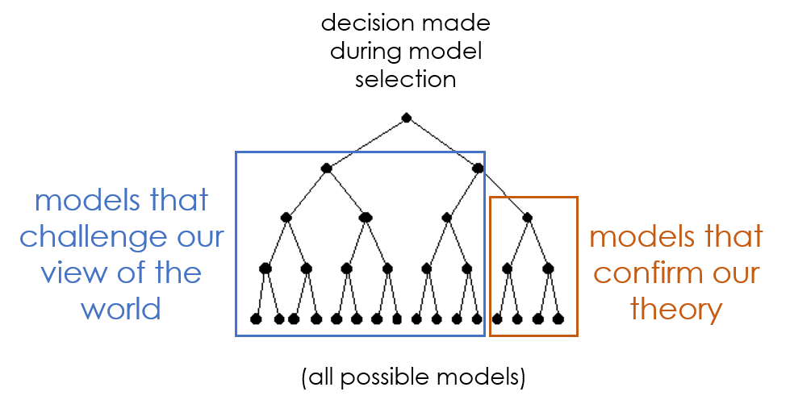
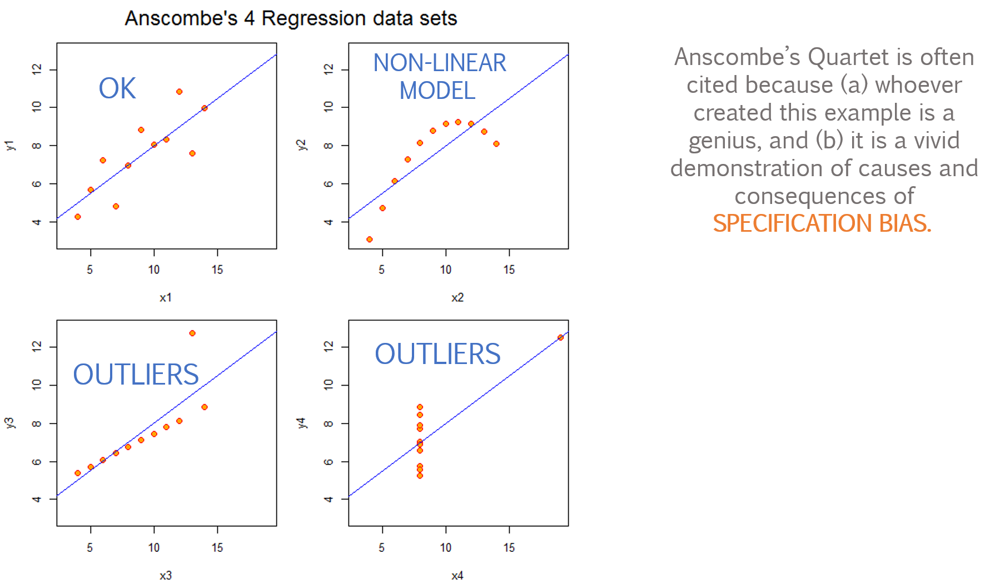
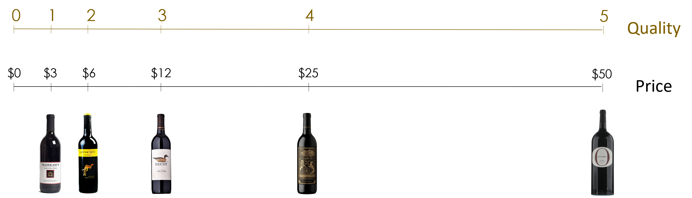
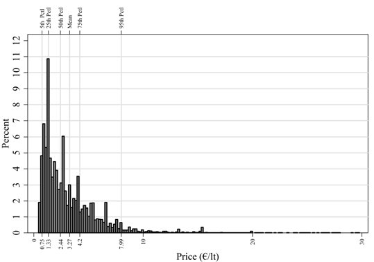
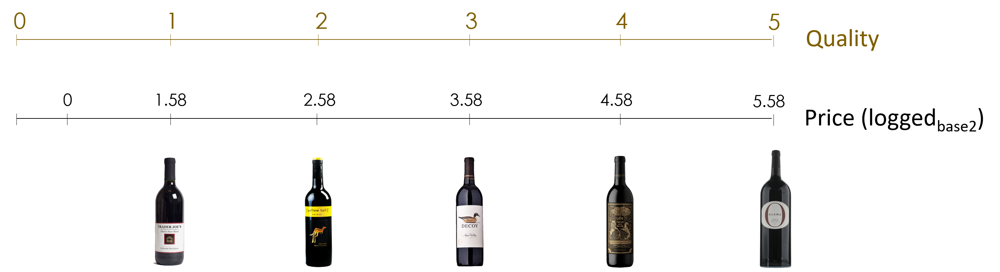
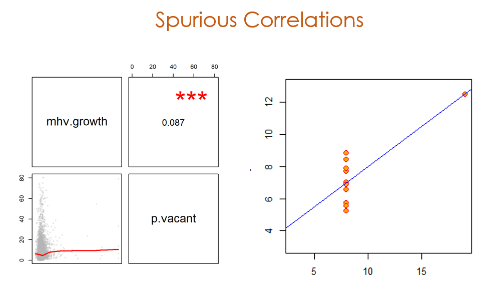
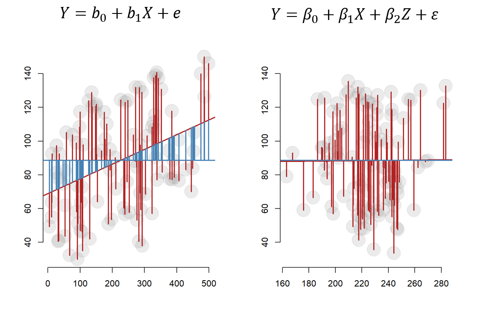
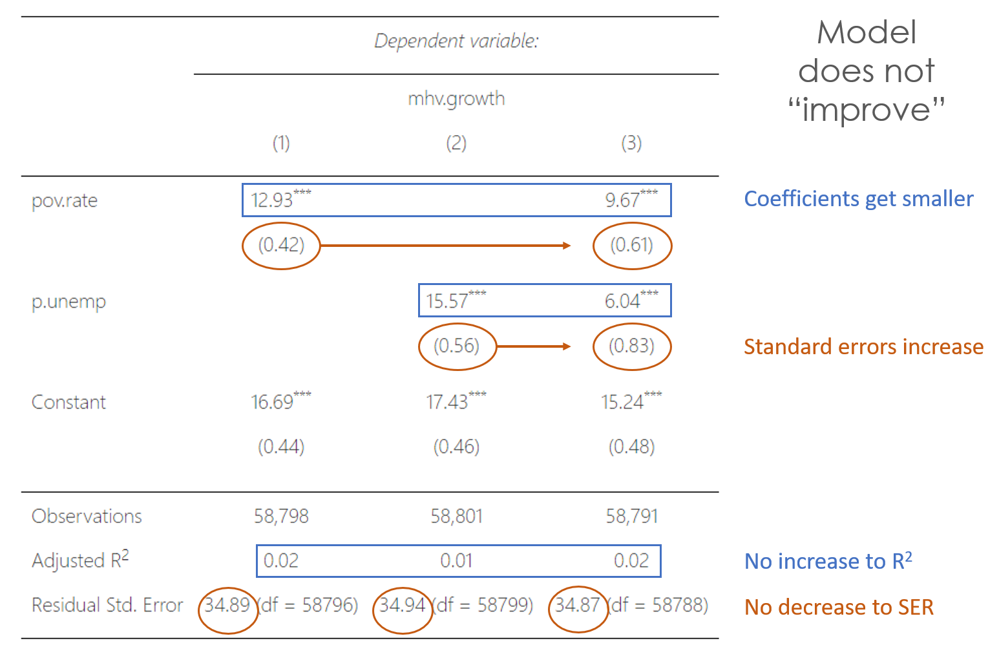

```{r setup, include=FALSE}
knitr::opts_chunk$set( echo=TRUE, message=F, warning=F, eval=T, fig.width=10 )
```


```{r}
library( dplyr )
library( knitr )
library( pander )
library( stargazer )
library( scales )

set.seed( 1234 )

# set stargazer type to text for 
# previewing in RMD docs but
# convert to type HTML when knitting
# (next code chunk)

s.type <- "text"  
```


```{r, echo=T}
###################################
#
#     STARGAZER SETTINGS
#
###################################

# DO NOT RUN CHUNK UNLESS KNITTING:
# changes table formats to html
# before rendering RMD docs

s.type <- "html"
```


Helper functions for the **pairs()** correlation table: 

```{r}
panel.cor <- function(x, y, digits=2, prefix="", cex.cor)
{
    usr <- par("usr"); on.exit(par(usr))
    par(usr = c(0, 1, 0, 1))
    r <- abs(cor(x, y))
    txt <- format(c(r, 0.123456789), digits=digits)[1]
    txt <- paste(prefix, txt, sep="")
    if(missing(cex.cor)) cex <- 0.8/strwidth(txt)
    
    test <- cor.test(x,y)
    # borrowed from printCoefmat
    Signif <- symnum(test$p.value, corr = FALSE, na = FALSE,
                  cutpoints = c(0, 0.001, 0.01, 0.05, 0.1, 1),
                  symbols = c("***", "**", "*", ".", " "))
    
    text(0.5, 0.5, txt, cex = 1.5 )
    text(.7, .8, Signif, cex=cex, col=2)
}

panel.smooth <- function (x, y, col = par("col"), bg = NA, pch = par("pch"), 
	cex = 0.5, col.smooth = "red", span = 2/3, iter = 3, ...) 
{
	points(x, y, pch = 19, col = gray(0.7,0.2), bg = bg, cex = cex)
	ok <- is.finite(x) & is.finite(y)
	if (any(ok)) 
		lines(stats::lowess(x[ok], y[ok], f = span, iter = iter), 
			col = col.smooth, lwd=2, ...)
}

# custom plot
jplot <- function( x1, x2, lab1="", lab2="", draw.line=T, ... )
{

	plot( x1, x2,
	      pch=19, 
	      col=gray(0.6, alpha = 0.2), 
	      cex=0.5,  
	      bty = "n",
	      xlab=lab1, 
	      ylab=lab2, cex.lab=1.5,
        ... )

	if( draw.line==T ){ 
		ok <- is.finite(x1) & is.finite(x2)
		lines( lowess(x2[ok]~x1[ok]), col="red", lwd=3 ) }

}
```


# Hedonic Housing Models 

The dependent variable in our model is the median home value. The choice draws on a large body of work on "hedonic pricing models" which assert that home values are a good price mechanism to capture the state of a neighborhood because they "price in" all of the characteristics of the house as well as the features of the neighborhood and surrounding city. 

Anyone who has ever paid $2,500 to rent a 400-square foot apartment in New York City know that when you acquire a dwelling you are paying for location as much as for the space to store your things and sleep at night. And location really means proximity to amenities, assurance of safety, and access to things like low taxes or high-performing schools. 

Hedonic pricing models use home value as the dependent variable, typically include features of the house (lot size, square footage, year built, number of bedrooms and bathrooms, etc.) to establish a baseline prediction of the value of the home based upon the house itself. They then incorporate many additional attributes of the neighborod to determine how people value things. Using this approach you can answer questions like, what is the value of having a park withing walking distance, i.e. what is the premium people will pay for homes that are near a park? What is the value of being in a good school district? What is the real-estate cost of proximity to a factory that produces toxic smoke? Does crime reduce the value of a home? Do new nearby bike lanes increase the value of homes? 

We don't have data on individual houses for this project, thus we can't run formal hedonic models that account for the features of a home. Rather, we have a census estimate of the median home value in a census tract. 

We also don't have recent sales data that would tell us exactly how much people are paying for homes. Rather, the Census estimates the Median Home Value by asking people how much their homes are worth. There are definite limitations to this methodology (people who are attached to their homes might over-value them, people who don't follow real estate might under-value them). But there is good work on "the wisdom of crowds" that shows that many independent guesses on topics like these, **once aggregated**, are pretty accurate. 

This fact was established partly by watching people try to guess the weight of a pig at the state fair to win a prize. The typical person was not very good at the task and thus their estimate was off by several dozen pounds. But people that do not have experience guessing the weight of pigs will get close enough, and they are also equally as likely to guess too high as they are to guess to low. So if you take all of the guesses from the crowd and average them you typically come within a pound or two of the actual weight! See: *Surowiecki, J. (2005). The wisdom of crowds.*

<hr>

### [Census Documentation on Methodology](https://www.census.gov/quickfacts/fact/note/US/HSG495218)

Value is the respondent's estimate of how much the property (house and lot) would sell for if it were for sale.

This tabulation includes only specified owner-occupied housing units--one-family houses on less than 10 acres without a business or medical office on the property. These data exclude mobile homes, houses with a business or medical office, houses on 10 or more acres, and housing units in multi-unit structures. Certain tabulations elsewhere include the value of all owner-occupied housing units and vacant-for-sale housing units. Also available are data on mortgage status and selected monthly owner costs.

The median divides the value distribution into two equal parts: one-half of the cases falling below the median value of the property (house and lot) and one-half above the median. Median value calculations are rounded to the nearest hundred dollars.

Owner-Occupied - A housing unit is owner-occupied if the owner or co-owner lives in the unit, even if it is mortgaged or not fully paid for. The owner or co-owner must live in the unit and usually is Person 1 on the questionnaire. The unit is "Owned by you or someone in this household with a mortgage or loan" if it is being purchased with a mortgage or some other debt arrangement such as a deed of trust, trust deed, contract to purchase, land contract, or purchase agreement. 

<hr>

Note that a census tract could feasibly contain a large number of businesses or rental units and a small number of houses or condos owned by citizens. These cases are conceptually challenging because the tract-level MHV is determined by a handful of homes. You will see below that we drop cases from the data with MHV less than $10,000 in 2000 and high home values in 2010. These are likely cases where the tract was a dirt lot that turned into a new development, or they were lofts or apartments in dense business districts converted to condos. In a few instances there were large public housing projects that were torn down and replaced with mixed use developments. 
As a result, many of the large percentage changes we see like a one thousand percent increase in home value are likely caused by small-sample problems and are not necessarily meaningful measures of change. The percent change variable is especially sensitive to small-sample problems because as the denominator approaches zero the value blows up to infinity. If you see a growth rate of 150,000 percent, it likely means that the median home value measure in 2000 was close to zero, not that the tract has actually changed in any meaningful way suggested by that magnitude. 

There are many ways to deal with outliers like these, but for now we will simply filter out values above and below thresholds that we feel are unrealistic and focus on the 95 percent of the data within these bounds. If there was time we would do an in-depth analysis of those data points to ensure we are not omitting meaningful cases. 

## Interpretation of Change in MHV

Similar to the hedonic housing models, the major assumption that our analysis relies upon is increases in the median home value in a neighbhorhood (Census tract) suggest the community is improving. We want to be careful here, because even the worst neighborhods in superstar cities will see home values increase, but at a much slower rate than all other neighborhods in the city. So "increase" needs to be contextualized. 

When home values increase in a community, after controlling for metro-level "secular" market trends, the change suggests that the neighborhood is more desirable for citizens of the city. That can be driven by improvements in homes. Or it can be driven by improvements in amenities near the community such as new restaurants or light rail, quality of life through lower crime or better parks, or through gentrification processes that might displace disadvantaged populations that have lower income and savings and thus real estate markets were less competitive. 

Median home value is going to capture all of these things, so at the very least it helps us measure change. Whether or not that change is a good thing depends on your perspective. People value *good* public transit, so they are willing to pay for proximity to light rail stations and metro stops. Even when a city can't charge high rates for fares, property values increase as a result of new public infrastructure, and thus the city can recover some of the construction costs over time. These are largely synergistic changes that can incentivize cities to invest in transit. 

Change diven by real estate speculation or by driving middle class families out of a neighborhood are still positive increases, but can be perceived as "bad" progress.  

In short, we will pay attention to the nuances of gentrification, but generally speaking we will interpret an increase in home value being a signal that both the housing stock and the quality of the neighborhood have improved. 


# Data

Load your wrangled datasets and prepare your variables for analysis:


```{r}
d1 <- readRDS( "data/rodeo/LTDB-2000.rds" )
d2 <- readRDS( "data/rodeo/LTDB-2010.rds" )
md <- readRDS( "data/rodeo/LTDB-META-DATA.rds" )

d1 <- select( d1, - year )
d2 <- select( d2, - year )

d <- merge( d1, d2, by="tractid" )
d <- merge( d, md, by="tractid" )
```


## Filter Rural Districts 

```{r}
table( d$urban )
d <- filter( d, urban == "urban" )
```


## Create New Variables

```{r}
# pro tip when getting started
# and exploring a lot of variables
# while making changes to your dataset:

d.full <- d  # keep a copy so you don't have to reload 
```


You will want to create more variables, but these examples will get you started. 


```{r}
d <- d.full  # reset to the original dataset

d <- select( d, tractid, 
             mhmval00, mhmval12, 
             hinc00, 
             hu00, vac00, own00, rent00, h30old00,
             empclf00, clf00, unemp00, prof00,  
             dpov00, npov00,
             ag25up00, hs00, col00, 
             pop00.x, nhwht00, nhblk00, hisp00, asian00,
             cbsa, cbsaname )

 
d <- 
  d %>%
  mutate( p.white = 100 * nhwht00 / pop00.x,
          p.black = 100 * nhblk00 / pop00.x,
          p.hisp = 100 * hisp00 / pop00.x, 
          p.asian = 100 * asian00 / pop00.x,
          p.hs = 100 * (hs00+col00) / ag25up00,
          p.col = 100 * col00 / ag25up00,
          p.prof = 100 * prof00 / empclf00,
          p.unemp = 100 * unemp00 / clf00,
          p.vacant = 100 * vac00 / hu00,
          mhv.change.00.to.10 = mhmval12 - mhmval00,
          p.mhv.change = 100 * (mhmval12 - mhmval00) / mhmval00,
          pov.rate = 100 * npov00 / dpov00 )


# adjust 2000 home values for inflation 
mhv.00 <- d$mhmval00 * 1.28855  
mhv.10 <- d$mhmval12

# change in MHV in dollars
mhv.change <- mhv.10 - mhv.00


# drop low 2000 median home values
# to avoid unrealistic growth rates.
#
# tracts with homes that cost less than
# $10,000 are outliers
mhv.00[ mhv.00 < 1000 ] <- NA

# change in MHV in percent
mhv.growth <- 100 * ( mhv.change / mhv.00 )

d$mhv.00 <- mhv.00
d$mhv.10 <- mhv.10
d$mhv.change <- mhv.change
d$mhv.growth <- mhv.growth 
```


```{r, echo=F}
head( d ) 
```


## Median Home value


```{r}
hist( mhv.00, breaks=200, xlim=c(0,500000), 
      col="gray20", border="white",
      axes=F, 
      xlab="MHV (median = $138k)",
      ylab="",
      main="Median Home Value in 2000 (2010 US dollars)" )

axis( side=1, at=seq(0,500000,100000), 
      labels=c("$0","$100k","$200k","$300k","$400k","$500k") )

abline( v=median( mhv.00, na.rm=T ), col="orange", lwd=3 )
```


##  Descriptives 


```{r, results="asis"}

df <- data.frame( MedianHomeValue2000=mhv.00, 
                  MedianHomeValue2010=mhv.10, 
                  MHV.Change.00.to.10=mhv.change,
                  MHV.Growth.00.to.12=mhv.growth )

stargazer( df, 
           type=s.type, 
           digits=0, 
           summary.stat = c("min", "p25","median","mean","p75","max") )
```


## Change in MHV 2000-2010


If a home worth \$10 million increased in value by \$100k over ten years it would not be that surprising. If a home worth \$50k increased by \$100k over the same period that is a growth of 200% and is notable. 

The change in value variable only reports absolute change, but does not provide a sense of whether that is a big or small amount for the census tract. 

```{r, fig.height=6}
hist( mhv.change/1000, breaks=500, 
      xlim=c(-100,500), yaxt="n", xaxt="n",
      xlab="Thousand of US Dollars (adjusted to 2010)", cex.lab=1.5,
      ylab="", main="Change in Median Home Value 2000 to 2010",
      col="gray20", border="white" )

axis( side=1, at=seq( from=-100, to=500, by=100 ), 
      labels=paste0( "$", seq( from=-100, to=500, by=100 ), "k" ) )
        
mean.x <- mean( mhv.change/1000, na.rm=T )
abline( v=mean.x, col="darkorange", lwd=2, lty=2 )
text( x=200, y=1500, 
      labels=paste0( "Mean = ", dollar( round(1000*mean.x,0)) ), 
      col="darkorange", cex=1.8, pos=3 )

median.x <- median( mhv.change/1000, na.rm=T )
abline( v=median.x, col="dodgerblue", lwd=2, lty=2 )
text( x=200, y=2000, 
      labels=paste0( "Median = ", dollar( round(1000*median.x,0)) ), 
      col="dodgerblue", cex=1.8, pos=3 )
```


## Percent Change in MHV 2000 to 2010

The percent change variable provides some context for growth rates of value in census tracts. 

Plot the percent change variable:

```{r, fig.height=6}
hg <-
hist( mhv.growth, breaks=5000, 
      xlim=c(-100,200), yaxt="n", xaxt="n",
      xlab="", cex.main=1.5,
      ylab="", main="Growth in Home Value by Census Tract 2000 to 2010",
      col="gray40", border="white" )

axis( side=1, at=seq( from=-100, to=200, by=50 ), 
      labels=paste0( seq( from=-100, to=200, by=50 ), "%" ) )

ymax <- max( hg$count )
        
mean.x <- mean( mhv.growth, na.rm=T )
abline( v=mean.x, col="darkorange", lwd=2, lty=2 )
text( x=100, y=(0.5*ymax), 
      labels=paste0( "Mean = ", round(mean.x,0), "%"), 
      col="darkorange", cex=1.8, pos=4 )

median.x <- median( mhv.growth, na.rm=T )
abline( v=median.x, col="dodgerblue", lwd=2, lty=2 )
text( x=100, y=(0.6*ymax), 
      labels=paste0( "Median = ", round(median.x,0), "%"), 
      col="dodgerblue", cex=1.8, pos=4 )
```


## Metro Level Statistics 

Both changes within a census tract and changes within a city can affect the price of a home. Since our policy of interest focuses on changes made within a tract (new business and new housing created through NMTC and LIHTC), we want to control for things happening at the metro level to ensure we are not inferring that programs that target the tract are driving outcomes when it is actually broad metro-level trends. 


You might want to calculate several metro-level statistics for your model (growth in population in the city, changes in demographics, changes in industry structure and wealth, for example). You can calculate a metro level statistic by aggregating up (population count) or averaging across census tracts. For example: 

```{r}
# average growth in median home value for the city
d <- 
  d %>%
  group_by( cbsaname ) %>%
  mutate( metro.mhv.change = median( mhv.change, na.rm=T ),
             metro.mhv.growth = 100 * median( mhv.growth, na.rm=T ) ) %>%
  ungroup() 
```


# Modeling Change

We are going to build our policy inferences in two stages. This lab will start by modeling changes in median home values that are predicted by tract characteristics in 2000 and changes in the city between 2000 and 2010.

In the following lab we will then add our policy variables - measures of government programs. 

Typically you will start with a simple model of the relationship of the policy and the outcome and add controls to improve the model. In some cases, especially when you have a large amount of data like this, it can be helpful building your models from the ground up starting with the controls. This ensures you understand all the specification considerations of your model before adding the one variable you care about. If your baseline model does not improve when adding the policy variable chances are the policy is not generating much impact. 


# Variable Selection 

Variable selection is the process of picking the **variables** and their **functional form** that you will include in the model. 

It is one of the most important steps in the process, but also it is an art, not a science. 

The goal in evaluation models is to **achieve strong model fit** while **accounting for competing hypothses** (alternative explanations to the assertion that the program or policy caused the change we see in the data).


## Types of Measures 

Note that we have two types of variables in these models: metrics from 2000 and metrics of change between 2000 and 2010. We have two units of analysis - census tract and metro area. And we have two ways to represent quantitative variables - as counts and as proportions.

Sometimes only one type is meaningful - the population of a census tract is not very meaningful because tracts are designed to hold 2000 to 4000 people, and they split when they grow. 

Population density, on the other hand, might be meaningful. The growth of the city between 2000 and 2010 is likely meaningful. 

The number of white people in a tract might not be meaningful, but the proportion of white people in a tract (a measure of diversity) likely is. 

So pay attention to how you are constructing variables, and whether the way you are presenting a variable (unit of analysis, time period, and count versus proportion) makes sense. 


## Challenges in Variable Selection 

Let's say we have 10 indendent variables to choose from, and we want a simple model with 3 independent variables. 

Each variable can be represented at the community (tract) or the metro (cbsa) level (unit of analysis). 

And each variable can be measured as counts or proportions. 

So each variable turns into 4 potential variables: 

1. X as count, tract level  
2. X as proportion, tract level  
3. X as count, metro level  
4. X as proportion, tract level 

So 10 variables x 2 units of anlysis x 2 metrics translates to approximately 40 distinct variables that we need to choose from:

So here is the real challanege: with 40 variables we can construct almost 10,000 unique 3-variable models!

```{r}
choose( 40, 3 ) %>% format( big.mark="," )
```

We actually have close to 100 census variables in our dataset and more than 4 different ways to represent each, so we have more than 10 million possible models to explore.

```{r}
choose( (4*100), 3 ) %>% format( big.mark="," )
```

The good news is that you should never construct models by trying random combinations of lots of variables. 

**Importance of Theory:**

Use theory to guide your variables. One of the reasons you have been asked to read a lot of background material on the topic is to develop some sensitivity to which variables matter. We know that white flight drove housing prices down in central city neighborhoods from 1980 to 2000, and the re-discovery of city life has been driving the rise in home values from 2000 to 2010. Young professionals especially want to live in diverse urban communities near transit and amenities, i.e. not suburbs. 

School quality has been a huge factor in driving the migration of the upper middle class to suburbs, so the rise in households that do not have children has removed one of the main barriers to urban living. The growth of cities has resulted in long and stressful commutes, making urban neighborhoods located near business districts more desirable. Baby boomers that fled cities when they started having kids are now selling their large suburban homes and buying smaller townhomes and condos that do not require as much maintenance and provide access to restaurants and cultural amenities that retired people have time to enjoy. 

Understanding some of the basic factors driving change can help you identify variables that can serve as proxies for some of these factors. 

It is helpful to test your understanding of your policy domain by trying to explain the main drivers of change to a hypothetical undergraduate student. Is the idea clear enough in your own mind to explain it to another person? How confident do you feel in your story? If you don't feel comfortable with this exercise, perhaps you should do some more background reading and reflection before you try to model anything!


## P-Value Hacking 

As mentioned above, the process of variable selection and model specification is complex partly because of the combinatorics of choice - with a large dataset like this one even a small model with three independent variables results in millions of possible models. 

The number sounds overwhelming, but it is less daunting when you consider that we never conduct analysis by trying random combinations of variables. Rather, we usually know which is the policy variable. We need to select the units of measure and functional form, so there are a couple of decisions necessary. But once we have settled on our first variable in the model we have removed a single degree of freedom, but that has a huge impact on remaining decisions. We have gone from over 10 million to around 78 thousand.  

```{r}
choose( (99*4), 2 ) %>% format( big.mark="," )
```

Based upon our background reading we know that there is one significant competing hypothesis that we want to account for, e.g. the socio-economic status of parents in the school classroom size example. Selecting that variable then eliminates more degrees of freedom.

In this way, the process of selecting a model looks like a decision tree:


In the end we might have 10 million *possible* models but when we follow some modeling process we see that several easy choices will eliminate lots of others. There will be many instances where you come to a fork in the road with two or more paths forward (variables to include, or units of measure to select). Often times you will try **all** of the roads one at a time, then return to the fork and use model fit statistics to determine which path forward is best. This is actually how some machine learning applications work - the process is called pruning the decision tree. 

And here lies the fundamental tension in social sciences. We want to find the model that best describes the data, but due to the incremental nature of model selection we will gravitate toward the options that we can make sense of. It is much more common to assume that a program is effective at the onset and look for evidence accordingly. If it a lot less common to begin an evaluation looking for lack of evidence of program success. As a result we are always vulnerable to confirmation bias. 




We are never objective bystanders or disinterested parties that approach the data with no agenda, merely interpretting the patterns for our audience. We are interested parties because our careers or our contracts often depend upon not missing something that would have allowed us to lend support to the program we are evaluating. As a result, we are extremely succeptible to confirmation bias. We are not the judge in the courtroom adjudicating truth in the data, we are the prosecutor that was given a job to make the strongest case possible about the guilt of the client, or in our case the effectiveness of a program. We try hard to tell a story with the data, and the funders or the peer reviewers serve as the jury that decides whether they believe the evidence. 

A natural consequence of this iterative process of model selection is that we tend to find our way to the models that support our theories. Partly this is because it is much easier to make that case that impact exists than it is to make the case that it doesn't. If you have done a reasonable job of accounting for soures of bias and you are able to identify program impact then your audience will be open to the results. The hard part is eliminating alternative competing hypotheses so you can make a convincing claim that the outcomes are a result of the program and not another explanation. 

If, however, you arrive at null results it is comparatively **much harder** to make the case that the program has no impact because there are so many things that can lead to null findings other than lack of program impact. If your sample size is too small you will have null results. If you have too much noise (measurement error) in the dependent variable you will have null results. If you have any bias that shifts the estimate of impact toward zero it can lead to null results. Oddly, it requires more evidence to convince people that something doesn't work than to convince them it does. One of the key contributors to the crisis of reproducibility in science is that it is much harder to publish null results than it is to publish a model with significant results. 

It's important to note that there is nothing nefarious about the process. The typical analyst is not manipulating data to achieve desired results. They are also typically not using brute force methods to run thousands of models that select the one that returns the largest program effects or smallest p-values. Rather, when you land on a branch of the decision tree where the data makes sense according to your task at hand or mental model of how the world works, which generates a comfortableness with the models. Alternatively, when you are getting null results you keep thinking that you must be doing something wrong, that there is something you are not seeing, so you continue to transform variables and try new models.

As a result, journals inadvertantly act as gatekeepers to suppress evidence that programs don't work or that a theory does not explain the world. Analysts and authors acquiesce and tweak the models so they fit expectations. Journals get interesting results. Authors get tenure. Everyone is happy. 


The problem is that all of these decisions are innocent enough, subtle enough, and harmless enough when they occur on a single paper. But at scale they begin to skew the body of evidence of an entire field. The problem is impossible to detect in a single paper because there is always randomness in sampling that could explain the result. In an era of big data and meta-analysis, however, it is possible to aggregate results across thousands of paper to see the distribution of published p-values. Sampling theory can be used to determine what the distribution of p-values should look like within a field. When compared against observed values in published studies it is possible to test for publication bias in a scientific field. As an example, some recent papers have aggregated thousands of published studies to demonstrate the improbably clustering of p-values right below 0.05 across various disciplines. It looks very similar to reported income in tax data right around the threshold where a slightly higher income would bump people into a higher tax bracket. When people are right near the threshold they all of a sudden need to take four weeks of vacation at the end of the year, or else they become very generous and donate thousands of dollars to a tax-deductible charity, thus dropping their taxable income below the threshold again. 


What these patterns often suggest is that the peer review process results in an under-reporting of null results. If we think about research as a cumulative endeavor where lots of studies on a topic contribute to the consensus about a phenomenon, then suppressing studies that generate small effect sizes is analogous to chopping off the lower third of your data - the average effect in a literature will be artificially large. And consequently, we might have too much confidence in the effectiveness of a cancer drug, we might believe management practices work when they don't, and we might promote public policies that we believe will improve lives but they end up generating very little impact and costing a lot of money.  

There is no evil villian in the story and there are no easy solutions to problems that arise naturally from cognitive biases that emerge from the way the brain manages comlexity and incentives in high-stakes systems. But science is adapting and professional norms are changing. Most notably, after recognizing that analysts operate like prosecutors making their case with data, it became apparent that a fair court requires a defense attourney as well. An important keystone of trial law is that all evidence must be shared between the legal teams so that the arguments for guilt or innocence are built through logic and persuasion, not suppression of information. 

Similarly, many evidence-based fields are moving toward open data and open science models because it has become apparent that peer review only works when reviewers have access to all of the same information that the authors do. A jury would never believe a prosecutor that makes the argument, I have evidence that exonorates my client, and I am not going to share the evidence with you but I need you to trust me that it exists and it is good evidence. The judge would throw the prosecutor out of the courtroom and require that all evidence be shared with the defense. 

Research and evaluation is no different. The evaluator's job **is** to make a strong case for the program. The emerging consensus is that a data and methods section in a paper or report is not sufficient to describe the process that generated the results. A proper court would give the data and code to the defense team so they can do their best to poke holes in the evidence and build counter-arguments. If the story can hold up to that level of scrutiny and cross-examination, then the research is robust. 

As you are learning during the project, sharing data and code is a non-trivial task. If you don't have clear documentation about the data, the process, and the programs that were used to generate results then no one will be able to make sense of a bunch of folders that contain a bunch of files. Similarly, the evidence might make it through ajudication via a jury of peers, but to have impact it has to also be adopted widely. Projects that use open data, share code via platforms like GitHub, and leverage free open-source tools are much more likely to be shared and replicated, leading to more impact. **Project management is a key component of effectiveness for the data scientist.**

Most importantly, awareness of the challenges of working with data should remind you to be diligent and humble. The next part of this tutorial will highlight some of the challenges of model specification to emphasize that caution and humility are required when doing data analytics. Running regressions and interpretting coefficients is the easy part. Being confident that you are explaining the world with any veracity is the hard part. It takes a lot of practice to become comfortable with the process, but it also takes a commitment to curiosity, a self-awareness about the process to avoid any aggregious types of p-hacking, and the willingness to test your assumptions.


# Specification 

Specification is the process of selecting variables and their functional form for your model. 

Typically you will go through the process of selecting variables that you believe capture your theory and allow you to test for important competing hypotheses.  

After creating your baseline model you will likely want to explore the functional form of variables in your model to see if there are transformations that improve your model. 

Throughout the process and in the final stages you will conduct sensitivity analysis and robustness checks to ensure that your results are not being biased or entirely driven by an outlier or the wrong functional form. There are many subtle ways that bias can sneak into models other than omitted variables. Recall the Anscombe examples where four datasets produced identical regression models (coefficients and significance levels) but have the following form: 



One clear lesson is never rely entirely on model fit statistics reported by your statistical software. You need to look at your data, check summary statistics to make sure variables seem plausible, and visualize your data as much as possible. 

Many problems are subtle. For example, maybe you are very comfortable with the functional form of your policy variable and your model fit. What happens if you transform a control variable? Change the measure from counts to proportions or add a quadratic term? Do your inferences remain the same, or do they vary widely when you alter controls? 

A good data scientist is always paranoid about problems in the data that you are hard to see, especially when you want to use observational data to make consequential decisions, like whether or not to continue a multi-billion dollar federal program or mandate state-wide reductions in class size.


## A Taxonomy of Specification Problems 

In CPP 523 you were introduced to the Seven Sins of Regression - issues that commonly plague cross-sectional models and prevent us from using observational data for causal inference. 

This lab will highlight some elements of specification that can be harmful to the ability to use the models for inference. 

We will introduce approaches to: 

* Variable skew 
* Multicollinearity 
* Outliers
* Group Bias 


### Variable Skew

It is common to have data that is not normally distributed, especially in the social sciences. Variables that have a high level of skew or kurtosis can cause problems with inferential statistics by biasing slopes or inflating standard errors. 

There are formal tests for skew, but the easiest way to diagnose the problem is by visualizing distributions using histograms or box and whisker plots. 

Let's start by looking at two of the census variables before and after log transformations: 


```{r, fig.height=4}
par( mfrow=c(1,2) )

hist( d$pov.rate, breaks=50, col="gray20", border="white",
      yaxt="n", xlab="", ylab="", main="Poverty Rate")
hist( log(d$pov.rate+1), breaks=50, col="gray20", border="white",
      yaxt="n", xlab="", ylab="", main="Poverty Rate (logged)")

hist( d$p.vacant, breaks=50, col="gray20", border="white",
      yaxt="n", xlab="", ylab="", main="Vacancy Rate")
hist( log(d$p.vacant+1), breaks=50, col="gray20", border="white",
      yaxt="n", xlab="", ylab="", main="Vacancy Rate (logged)")
```


We know that bell-shaped curves are typically preferable, but it's not clear how that helps when looking at a single variable. The issues are clearer when looking at the relationship between two skewed variables: 


```{r, fig.height=4}
log.p.vacant <- log10( d$p.vacant + 1 )
log.pov.rate <- log10( d$pov.rate + 1 )
these <- sample( 1:length(log.pov.rate), 5000 )

par( mfrow=c(1,2) )
jplot( d$pov.rate[these], d$p.vacant[these], 
       lab1="Poverty Rate", lab2="Vacant Homes (percent)",
       main="Raw Measures" )
jplot( log.pov.rate[these], log.p.vacant[these], 
       lab1="Poverty Rate", lab2="Vacant Homes (percent)",
       main="Log Transformed" )
```


We have now greatly strenghtened the relationship between these variables: 

```{r, results="asis"}
cor( d$p.vacant, d$pov.rate, use="pairwise.complete" )
cor( log.p.vacant, log.pov.rate, use="pairwise.complete" )
```


### Log Transformations 

What exactly does a log transformation do again? Technically, they convert a one-unit change in a variable from a level to a rate of growth. You can read the [more precise technical definition here](https://ds4ps.org/cpp-523-spr-2020/lectures/specification-bias.html#logged-regression-models).

But the real intuition comes from understanding the origins of skew. There are many processes in natural and social systems that are governed by exponential, not linear, growth. As the systems progress and differences compound, each additional unit of time results in larger changes in the system.


We can think of another example that originates from diminishing marginal returns. How much does it cost to increase the quality of a bottle of wine? Vinyards can use things like better grapes, better fertilizer, better viticulture, and better land to improve the quality of their product. Producers will do the cheapest things first, maybe buy new equipment to harvest and press grapes. Planting better grapes is expensive because it costs money for the vine stocks and grapes from newly-planted vines are not used in wine-making for at least a year. But they are fixed cost investments that can be amortized over time. Hiring a better vintner to oversee the production of wine will have a big impact on quality, but requires the ongoing cost of paying a large salary to a highly-paid specialist. When all of these options have been exhausted, the last step to improving wine quality is acquiring better land in a region amenable to grapes. This land, however, is very expensive. 

As a result, if you ever pay attention to the price of wine at the store you will see that there are what appear to be several jumps in price. The cheapest table wine you can find costs around \$3. It's not great wine, so if you want to upgrade to a decent table wine the prices cluster around \$6. If you are bringing a bottle to dinner at a friend's house and you want something slightly nicer the price is about \$12. If you want to splurge for a holiday celebration you will find the next step up in class clusters around \$25, and after that $50. 

Do you see the patern here? For each additional unit increase in quality the price doubles. It is an exponential scale. When you are producing cheap wine you can spend a small amount of money to get better equipment to improve quality by one point on this five point scale. The next step up in quality is more costly. And the step after that requires even more capital. 



Consequently, if you look at data on wine prices you will find a skewed distribution with the market dominated by inexpensive wine and more limited selection in each additional quality traunch (Source-AC-Nielsen):




If we wanted to conduct a study on the relationship between wine price and customer satisfaction (spoiler alert, [the relationship is nebulous](https://www.wired.com/2011/04/should-we-buy-expensive-wine/)) we would introduce specification bias by trying to model quality as a linear function of price. 

Alternatively, if we take into account that the relationship between price and quality might not be linear and knowing that price is a skewed variable we can adjust our hypothesis and specification accordingly. It's not that price doesn't matter (as the article in the previous paragraph suggests) but we need a better specification to model the relationship. If we transform price using a log scale the relationship becomes clear.




```{r, echo=F}
library( scales )
price <- rep( 3:50, times=50:3 ) 
price <- price + rnorm( length(price), 0, 0.25 ) %>% round(2)
quality <- log2( price ) + rnorm( length(price), 0, 0.5 ) 
quality <- rescale( quality, to=c(0,5) ) %>% round(1)

# sample_n( data.frame( price, quality ), 10 ) %>% pander()
```

In the regular levels data the relationship between price and satisfaction is very strong up until $20, then it weakens considerably. In the model where price has been converted to a log scale the relationship is a lot cleaner and the model is a better fit, which will results in smaller standard errors and a higher likelihood of finding results that support our theorized relationship between price and quality.  


```{r}
par( mfrow=c(1,2) )
jplot( price, quality,
       lab1="Price of Wine (USD)",
       lab2="Quality Rating")
abline( h=3.1, col="steelblue", lty=3 )
abline( v=20, col="steelblue", lty=3 )

jplot( log2(price), quality, xlim=c(1,6),
       lab1="Price of Wine (log2)",
       lab2="Quality Rating" )
```


**Addressing Skew in Census Data:**

Returning to our census variables, when we look at the relationship between variables in the scatterplot we see that a lot of the data clusters in the lower left hand corner of the scatterplots, which is a sign of skew:


```{r, fig.height=10}
# create subset to visualize in correlation matrix 
d2 <- select( d, mhv.growth, p.vacant,  p.prof,  pov.rate, p.unemp )

# reduce data density for visualization
set.seed( 1234 )
d3 <- sample_n( d2, 10000 ) %>% na.omit()

# correlation plots
pairs( d3, upper.panel=panel.cor, lower.panel=panel.smooth )
```


After applying log transformations note that the bivariate correlations increase except for relationship between MHV and (mhv.growth) vacancy rates (p.vacant):

```{r, fig.height=10}
set.seed( 1234 )

d2 <- select( d, mhv.growth, p.vacant, p.prof,  pov.rate, p.unemp )

# recode some vars to remove outliers and skew
d2$mhv.growth[ d2$mhv.growth > 200 ] <- NA
d2$p.unemp <- log10( d2$p.unemp + 1 )
d2$p.vacant <- log10( d2$p.vacant + 1 )
d2$p.prof <- log10( d2$p.prof + 1  )
d2$pov.rate <- log10( d2$pov.rate + 1 )

d4 <- sample_n( d2, 5000 ) %>% na.omit()
pairs( d4, upper.panel=panel.cor, lower.panel=panel.smooth )
```


The correlation between the transformed version of median home value change and vacancy rates falls, but is that a bad thing? The non-transformed version contains a statistically-significant correlation, but take a look at the scatterplot: 


```{r}
jplot( d3$p.vacant, d3$mhv.growth, ylim=c(-50,100),
       lab1="Vacancy Rates", lab2="MHV Growth" )
```


It is likely an inflated correlation because of the handful of outliers. Does the graph look familiar? Recall the plot on the right from Anscombe's Quartet: 




So fixing skew made the correlation weaker, but represents a case of mitigating a spurious correlation that was caused by outliers in the data. 


## Multicollinearity

Recall that one way to think about a control variable that serves as a competing hypothesis is a variable that deletes "problematic" variance that might be the true explanation for the program change, reducing the variance available for the policy variable to the components that are independent (uncorrelated) with the controls. 

 

Multicollinearity occurs when two variables in the model are highly correlated. If both are included in the model at the same time they can essentially cancel each other out. Standard errors will increase and slopes typically shift toward the null. As a result, even if they pair of variables are individually significant and have large effect sizes, they will have small slopes and lack statistical significance when included toghether.

 

Multicollinearity is common when there are mutiple variables that represent different measures of the same underlying construct in the same dataset. In studies of firms, for example, revenue, firm expenses, and number of employees are all measures of firm size and thus will be highly correlated. Including them all in the model will results in none of them having large or significant slopes. 

This is important **specifically when you need to interpret a regression coefficient**. In the firm example, perhaps you are interested in whether or not companies that use a specific HR practice are more profitable, controlling for size and industry. In this case including all of the size controls together would not hurt because you are not interpretting the control in your analysis. 

In our case, perhaps we are interested in whether economically distressed tracts are likely to grow faster than tracts that have already gentrified because of rent gap theory (urban core neighborhoods with lots condemned houses and vacant lots are easier to use for large-scale projects since land is cheap, so developers would target these communities instead of stable neighborhoods where land is expensive and zoning more complicated). If we include multiple measures of distress (unemployment rate, poverty rate, high school drop-out rate) and multiple measures of stability (number of people working in professional industries, percentage with college degrees, rates of divorce) then the high correlation between any set of variables can mute the slopes, making it hard to interpret the results. 

Take this example where we try to include both poverty rate and unemployment. A sign of multicollinarity is when both coefficients get smaller and the standard errors get bigger when the two variables are included in the same model (model 3 here). 


```{r, results="asis"}
reg.data <- d

reg.data$mhv.growth[ reg.data$mhv.growth > 200 ] <- NA
reg.data$p.unemp <- log10( reg.data$p.unemp + 1 )
reg.data$p.vacant <- log10( reg.data$p.vacant + 1 )
reg.data$pov.rate <- log10( reg.data$pov.rate + 1 )

m1 <- lm( mhv.growth ~  pov.rate, data=reg.data )
m2 <- lm( mhv.growth ~  p.unemp, data=reg.data )
m3 <- lm( mhv.growth ~  pov.rate + p.unemp, data=reg.data )


stargazer( m1, m2, m3, 
           type=s.type, digits=2,
           omit.stat = c("rsq","f") )
```


Note that: 

* coefficient sizes are smaller 
* standard errors are larger 
* R-square did not increase 
* The SER did not decrease  

*The standard error of the regression (SER) is the "average distance" of each data point to the regression line, so a measure of how accurate the model is when used for prediction. Similar to R-square, it is a measure of model fit."



This suggests that these variables contain redundant information and including them both together causes them to cancel each other out. 

If these were simply control variables it would not harm your model, per se. But if these are competing hypotheses and thus you are interpretting the magnitude of effects relative to the policy variable you have now muted part of their effect, making them look less important. If they are highly correlated they can cancel each other out almost completely in your model. 

When you are worried about multicollinearity: 

1. Check your correlation matrix for independent variables that are highly correlated. Ask yourself, are these two distinct constructs, or two measures of the same construct? 
2. Run the model with each of the suspect variables separately and one with them all together like the example above. This will show you how much the estimate of their impact changes when all are included together.

If you have high multicollinearity and you want to interpret the variables then:

1. Select which variable you believe best captures the theory / hypothesis or the one you belive to be the best measure of the underlying construct. 
2. Combine the variables into a single scale or index. Use factor analysis (preferred option) or normalize variables and select a set that generates a reliable metric like you have done in a previous lab. 


## Group Structure

When building models it is important to think about whether there are groups in the data that would influence the outcome. You will cover this topic in the lecture on [Fixed Effect Models](https://ds4ps.org/pe4ps-textbook/docs/p-040-fixed-effects.html) in CPP 525. 

In this domain we know that neighborhoods belong to cities, and cities each have distinctive histories, political structures, economies, geographies and climates. Some cities were thriving over the study period and experienced population growth and strong economic expansion (relatively speaking, all were impacted by the 2001 and 2008 economic crises). Others were in decline, losing population and had shrinking economies. 

These are broad city-level processes that unfold over decades. No individual census tract within a city will be isolated from these trends occuring metro-wide. As a result we would expect the overall health of the city to impact the home values in each tract. 


```{r, fig.height=4, fig.width=10}
d5 <- filter( d, cbsaname %in% 
                c("Tyler, TX",
                  "Minneapolis-St. Paul-Bloomington, MN-WI",
                  "San Francisco-San Mateo-Redwood City,CA") )

d5$cbsaname <- factor( d5$cbsaname, labels=c("MSP-MN","SF-CA","Tyler-TX") )

par( mar=c(4,6,4,6), mfrow=c(1,2) )
plot( d5$cbsaname,  d5$mhv.00, las=1, frame.plot=F, outline=F,
      xlab="", ylab="", main="Home Values in 2000" )
abline( h=seq(0,1200000,100000), lty=3, col=gray(0.5,0.3) )
axis( side=4, las=1 )

plot( d5$cbsaname,  d5$p.unemp, las=1, frame.plot=F, outline=F,
      xlab="", ylab="", main="Unemployment Rates in 2000" )
abline( h=seq(0,15,1), lty=3, col=gray(0.5,0.3) )
axis( side=4, las=1 )

```


We know that the health of the city in 2000 and the changes that occur at the metro level between 2000 and 2010 will impact all census tracts in the city. We can see the metro-level clustering in a plot:

```{r}
d5 <- filter( d, cbsaname %in%
                c("Tyler, TX",
                  "Youngstown-Warren-Boardman, OH-PA",
                  "Syracuse, NY") )

d5$mhv.growth[ d5$mhv.growth > 200 ] <- NA
d5$p.unemp <- log10( d5$p.unemp + 1 )

x <- rnorm( nrow(d5), 0, 0.1 ) +
     as.numeric( d5$cbsaname == "Tyler, TX" ) + 
     2 * as.numeric( d5$cbsaname == "Youngstown-Warren-Boardman, OH-PA" ) + 
     3* as.numeric( d5$cbsaname == "Syracuse, NY" ) 


par( mfrow=c(1,2) )

plot( x, d5$mhv.growth, 
      pch=19, cex=1.5, bty = "n",  
	    col=factor(d5$cbsa),
      ylim=c(-50,50),
      xaxt="n", 
      ylab="", xlab="",
      main="MHV Growth")
axis( side=1, at=1:3, labels=c("Tyler","Youngstown","Syracuse"), 
      tick=F, col.axis="gray60", cex.axis=1.3 )

plot( x, d5$p.unemp, 
      pch=19, cex=1.5, bty = "n",  
	    col=factor(d5$cbsa),
      # ylim=c(0,40),
      xaxt="n", 
      ylab="", xlab="",
      main="Unemployment (logged)")
axis( side=1, at=1:3, labels=c("Tyler","Youngstown","Syracuse"), 
      tick=F, col.axis="gray60", cex.axis=1.3 )


```

Which would result in different baseline metro-level home value growth rates in a model when each city is given its own intercept. 

```{r}
# d5 <- filter( d, cbsaname %in% 
#                 c("Tyler, TX",
#                   "Youngstown-Warren-Boardman, OH-PA",
#                   "Syracuse, NY") )
# 
# d5$mhv.growth[ d5$mhv.growth > 200 ] <- NA
# d5$p.unemp <- log10( d5$p.unemp + 1 )

m <- lm( mhv.growth ~ factor(cbsaname) + p.unemp - 1, data=d5 )

b0.syracuse   <- m$coefficients[1] 
b0.tyler      <- m$coefficients[2] 
b0.youngston  <- m$coefficients[3] 
b1            <- m$coefficients[4] 

palette( c( "steelblue", "green3", "darkorange"  ) )
palette( adjustcolor( palette(), alpha.f = 0.3 ) )

plot( d5$p.unemp, d5$mhv.growth,
	    pch=19, cex=1.5, bty = "n",  
	    col=factor(d5$cbsa),
      ylim=c(-50,50),
      xlab="Unemployment Rate (logged)",
      ylab="Median Home Value Growth 2000-2010")
	      
abline( b0.syracuse, b1, col="steelblue", lwd=3 )
abline( b0.tyler, b1, col="green3", lwd=3 )
abline( b0.youngston, b1, col="darkorange", lwd=3 )

```


You probably recognize this approach as a city-level fixed effect. Since the metro area is a salient contextual variable it is extremely important to account for it if you want to remove bias from your estimates. For an in-depth discussion review the [lecture notes](https://ds4ps.org/pe4ps-textbook/docs/p-040-fixed-effects.html), but for a simple example consider the following. 

We want to know whether having more college graduates living in a community will increase MHV growth over the study period. We exame two tracts located in different cities:

|   |   |   | 
|-----|--------|--------|      
| Community | A | B |     
| % Over 25 w College Degree | 50% | 20% |      
| MHV Growth 2000-2010 |  10%  |  30%  |    


It looks as though college graduates suppress growth, but if we dig deeper into the data we see that Tract A is located in a city in decline. The average tract in the city saw median home values **decrease** by 5%, so comparatively a growth of 10% was high for the city. Comparatively, Tract B is located in a rapidly-growing city. The average median home value growth is 50% in the metro area, so comparatively 30% in the tract was low for the city. 

Once we account for the census tract context (the overall economic trends in the metro area) then the relationship makes sense again - tracts with more college graduates are growing faster *than other tracts in the same metro area*.


We account for context by adding a metro-level fixed effect to the model. Alternatively, we can add the average median home value growth of the metro area as a control variable:

```{r, results="asis"}
d.reg <- d

d.reg$mhv.growth[ d.reg$mhv.growth > 200 ] <- NA
d.reg$p.unemp <- log10( d.reg$p.unemp + 1 )

# average growth in median home value for the city
d.reg <- 
  d.reg %>%
  group_by( cbsaname ) %>%
  mutate( metro.mhv.growth = 100 * median( mhv.growth, na.rm=T ) ) %>%
  ungroup() 

m1 <- lm( mhv.growth ~ p.unemp, data=d.reg )
m2 <- lm( mhv.growth ~ p.unemp + metro.mhv.growth, data=d.reg )
m3 <- lm( mhv.growth ~ p.unemp + cbsa, data=d.reg )

stargazer( m1, m2, m3, 
           type=s.type, digits=2,
           omit.stat = c("rsq","f"),
           omit="cbsa",
           add.lines = list(c("Metro Fixed Effects:", "NO", "NO","YES")) )
```


Note that model 2 and model 3 produce similar slopes for unemployment, similar R-squares, and similar standard error of the regression (labeled Residual Std. Error here). Recall that we can run a fixed-effect model by demeaning our data using group-level means. Adding a metro-level control will achieve a similar result.

The metro-level fixed effect is preferable because it will anchor the dependent variable as well. But when not possible adding a group-level mean of the dependent variable is a feasible alternative. 

Recall that fixed effects will automatically control for **any** time-invariant characteristics of the city, such as geography, culture, climate, type of city government, etc. Any variable that would not change between 2000 and 2010 does not need to be included in the model after the metro level fixed effect is added. 

HOWEVER, it does not control for time-varying factors at the metro level. For example, it would be wise to control for the growth rate of the city since that will drive demand for houses, and should impact prices. There are lots of 


```{r, results="asis"}
d.reg <- d

d.reg$mhv.growth[ d.reg$mhv.growth > 200 ] <- NA
d.reg$p.unemp <- log10( d.reg$p.unemp + 1 )

# average growth in median home value for the city
d.reg <- 
  d.reg %>%
  group_by( cbsaname ) %>%
  mutate( metro.mhv.growth = 100 * median( mhv.growth, na.rm=T ) ) %>%
  ungroup() 

m1 <- lm( mhv.growth ~ p.unemp, data=d.reg )
m2 <- lm( mhv.growth ~ p.unemp + metro.mhv.growth, data=d.reg )
m3 <- lm( mhv.growth ~ p.unemp + cbsa, data=d.reg )

stargazer( m1, m2, m3, 
           type=s.type, digits=2,
           omit.stat = c("rsq","f"),
           omit="cbsa",
           add.lines = list(c("Metro Fixed Effects:", "NO", "NO","YES")) )
```


```{r}
d2 <- select( d.full, 
             
             tractid, cbsa, cbsaname,            # ids / units of analysis
             
             mhv.00, mhv.10, mhv.change, pct.change,    # home value 
             
             hinc00, hu00, own00, rent00,        # ses
             hinc12, hu10, own10, rent10,
             
             empclf00, clf00, unemp00, prof00,   # employment 
             empclf12, clf12, unemp12, prof12,
             
             dpov00, npov00,                     # poverty
             dpov12, npov12,
             
             ag25up00, hs00, col00,              # education 
             ag25up12, hs12, col12,
             
             pop00.x, nhwht00, nhblk00, hisp00, asian00,   # race
             pop10, nhwht10, nhblk10, hisp10, asian10
             
          ) # end select


d2 <- 
  d2 %>%
  mutate( 
          # 2000 variables
          p.white.00 = 100 * nhwht00 / pop00.x,
          p.black.00 = 100 * nhblk00 / pop00.x,
          p.hisp.00 = 100 * hisp00 / pop00.x, 
          p.asian.00 = 100 * asian00 / pop00.x,
          p.hs.edu.00 = 100 * (hs00+col00) / ag25up00,
          p.col.edu.00 = 100 * col00 / ag25up00,
          p.prof.00 = 100 * prof00 / empclf00,
          p.unemp.00 = 100 * unemp00 / clf00,
          pov.rate.00 = 100 * npov00 / dpov00,
          
          # 2010 variables
          p.white.10 = 100 * nhwht10 / pop10,
          p.black.10 = 100 * nhblk10 / pop10,
          p.hisp.10 = 100 * hisp10 / pop10, 
          p.asian.10 = 100 * asian10 / pop10,
          p.hs.edu.10 = 100 * (hs12+col12) / ag25up12,
          p.col.edu.10 = 100 * col12 / ag25up12,
          p.prof.10 = 100 * prof12 / empclf12,
          p.unemp.10 = 100 * unemp12 / clf12,
          pov.rate.10 = 100 * npov12 / dpov12 )

d2 <-
  d2 %>%
  group_by( cbsaname ) %>%
  mutate( metro.mhv.pct.00 = ntile( mhv.00, 100 ),
          metro.mhv.pct.10 = ntile( mhv.10, 100 ),
          metro.median.pay.00 = median( hinc00, na.rm=T ),
          metro.median.pay.10 = median( hinc12, na.rm=T ),
          metro.race.rank.00 = ntile( (100-p.white.00), 100 ) ) %>%
  ungroup() %>%
  mutate( metro.mhv.pct.change = metro.mhv.pct.10 - metro.mhv.pct.00,
          pay.change = metro.median.pay.10 - metro.median.pay.00,
          race.change = p.white.10 - p.white.00,
          mhv.change = mhv.10 - mhv.00 )


```


<hr>
<hr>
<hr>


##


## Model Fit


```{r, results="asis"}
d2 <- select( d, mhv.growth, p.vacant, p.prof,  pov.rate, p.unemp, p.white, own00, col00, cbsa )

# recode some vars to remove outliers and skew
d2$mhv.growth[ d2$mhv.growth > 200 ] <- NA
d2$p.unemp.log <- log10( d2$p.unemp + 1 )
d2$p.vacant.log <- log10( d2$p.vacant + 1 )
d2$p.prof.log <- log10( d2$p.prof + 1  )
d2$pov.rate.log <- log10( d2$pov.rate + 1 )

# drop rows with missing values 
d2 <- na.omit( d2 )

m <- lm( mhv.growth ~ 
           p.vacant + own00 + 
           p.prof + col00 + 
           p.unemp + pov.rate + 
           p.white, 
           data=d2 )


stargazer( m,
           type=s.type, digits=2,
           omit.stat = c("rsq","f"),
           omit="cbsa" )
```


```{r, fig.height=8, fig.width=8, eval=F}
# regression model drops rows with NAs:
# na.action lists row numbers that were dropped
# d2 <- reg.data[ - m$na.action , ]

coefficients(m)

plot( d2$mhv.growth, m$fitted.values, bty="n",
      xlim=c(-100,200), ylim=c(-100,200),
      pch=19, cex=0.5, col=gray(0.5,0.3),
      xlab="Actual MHV % Change", 
      ylab="Predicted MHV % Change" )

abline( h=seq(-100,300,50), lty=2, col="gray" )
abline( v=seq(-100,300,50), lty=2, col="gray" )
abline( a=0, b=1, col="red", lwd=2 )
```


## Diagnostic Statistics 


```{r, eval=F}
reg.data$log.change <- 100*( log(reg.data$mhv.10+1) - log(reg.data$mhv.00+1))


m5 <- lm( mhv.growth ~ p.vacant + p.white + p.black + 
            p.col + pov.rate + p.unemp + factor(cbsa), data=reg.data )
m6 <- lm( log.change ~ p.vacant + p.white + p.black + 
            p.col + pov.rate + p.unemp + factor(cbsa), data=reg.data )


stargazer( m5, m6,
           type=s.type, digits=2,
           omit.stat = c("rsq","f"),
           omit="cbsa" )
```


```{r, eval=F}
plot( m5 )
```


```{r, fig.height=8, fig.width=8, eval=F}
# regression model drops rows with NAs:
# na.action lists row numbers that were dropped
d2 <- reg.data[ - m6$na.action , ]

plot( d2$log.change, m6$fitted.values, bty="n",
      xlim=c(-100,200), ylim=c(-100,200),
      pch=19, cex=0.5, col=gray(0.5,0.3),
      xlab="Actual MHV % Change", 
      ylab="Predicted MHV % Change" )

abline( h=seq(-100,300,50), lty=2, col="gray" )
abline( v=seq(-100,300,50), lty=2, col="gray" )
abline( a=0, b=1, col="red", lwd=2 )
```


# Part 1 - Communty 

Which community health indicator in 2000 is the best predictor of a neighborhood (tract) 


# Predicting Change


# Gentrification 


<br>
<br>

<hr>

<br>
<br>


<style>
blockquote {
    padding: 11px 22px;
    margin: 0 0 22px;
    font-size: 18px;
    border-left: 5px solid lightgray;
}

</style>

