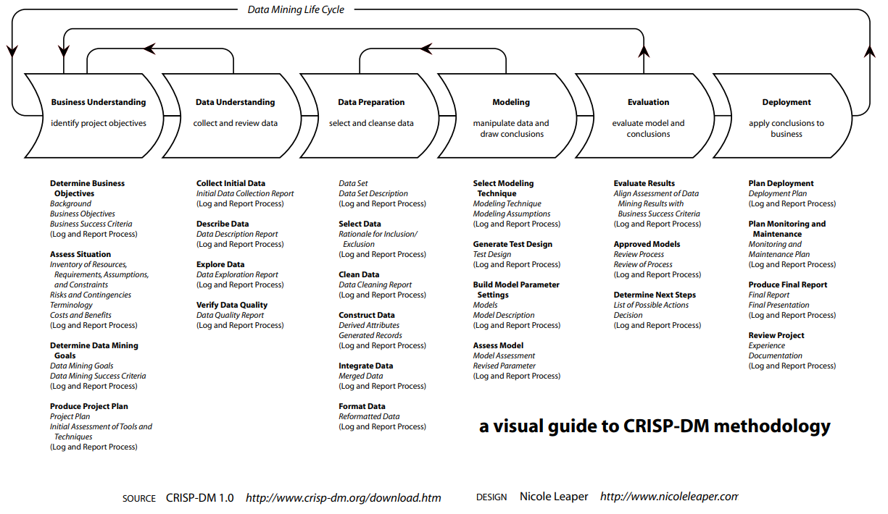
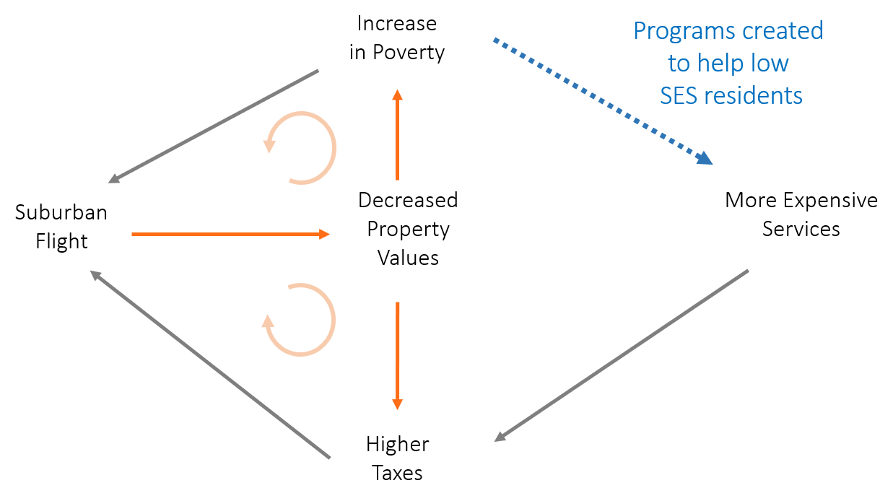

 
<!--- 
New sections start with 2 stars:  ** Section Title
New units start with 3 stars:     *** {Unit Metadata}
-----------------------------start example
** Section-I
*** { @unit = "15th Nov", @title = "Course Overview", @reading, @lecture, @assignment, @foldout }
-----------------------------end example
Unit Metadata is comprised of:
@unit - date or number
@title - unit name
@reading - turn on reading icon
@assignment - turn on lecture icon
@lecture - turn on lecture icon
@foldout - activate unit content (allow foldout)
Submit Buttons - 
  <a class="uk-button uk-button-primary" href="{{page.canvas.assignment_url}}">Submit Lab</a>
  <a class="uk-button uk-button-primary" href="{{page.canvas.yellowdig_url}}">YELLOWDIG</a>
-->


<!--- 
######################################################
####
####      Intro
####
######################################################
-->

** Course Overview 


<!---     #######################################################       -->
<!---     #######################################################       -->

*** { @unit = "", @title = "Motivating the Course", @foldout   }

<br> 

## High Demand for Project Management Skills 

Social scientists are not taught how to manage large data projects. It has just been assumed that if you can run models with data, you intuitively know how to manage your data and code. Several things have changed: 

*	Most work is now done by teams, not individuals (Wuchty et al, 2007), adding coordination costs and creating opportunities for project workflow errors (files saved in wrong folders, failing to use the most recent code, no documentation of changes made). 
*	Most projects use data constructed by combining several sources, adding complexity and opportunities to introduce errors through improper merges or re-coding of data.
*	The final analysis presented in reports or publications typically consists of thousands of lines of computer code, creating the need for testing and quality control. Even the smartest people in the business make mistakes.  

When project management is not effectively deployed consequences can be dire: 

<hr>

*Researcher’s from Duke university published a study on using personalized-genomics for patient-specific chemotherapy treatment. Two researchers, Baggerly and Coombes, from MD Anderson requested the data and code. It took many months of back-and-forth (hounding) to actually get the data and code — when they did it was disorganized and poorly documented. Baggerly and Coombes eventually found an error in the code, showing it actually put patients at risk, leading to a major lawsuit and terminated clinical trials.*  

From: “The “Gold Standard” for Data Science Project Management”

<hr>


## Errors in Data Programming

Not all errors are equal. The most unethical and egregious involve conscious manipulation of data or results to commit scientific fraud for professional gain (or often just survival in high-pressure jobs and competitive publishing and funding environments). Fortunately, that appears to the be least common type of error. 

There is also a difference between non-reproducible results and erroneous results. There are many factors that can lead to the publication of questionable results. Some come from basic human biases built into how we seek and process information (“confirmation bias”). When you combine these biases with statistical analysis you get p-value hacking. Some reasons are related to biases built into the publication process itself. See the blog, “6 Factors causing the replication crisis in medical research.” And some are due to the complexity of the scientific process that result in perfectly valid results that came from conditions that can be hard to replicate or generalize. 

For example, psychology has received a lot of attention because of some high-profile studies that have been challenged, what has been termed the "reproducibility crisis". The reproducibility crisis in academic scholarship is an example of the types of issues that arise in any complex data work. Academics is a useful example because the recent crisis has motivated open science advocates to conduct reviews of published research to systematically measure how much error exists in scientific work. Some issues, like biased introduced through peer review, are particular to the field. But many of the issues, especially errors in data and code, are more generally instructive to any work that involves data and analytics. 

Error in research is its own special animal that is unique from most other forms of non-replicability, but it does contribute to it. Error in this context means things like (1) combining datasets in a way that corrupts the relationship between subjects and observations, (2) missing data caused by failed merges or improper filters, (3) incorrectly recoding or transforming variables, (4) mathematical errors or logical errors made with math, or (5) errors in modeling or misinterpretation of models, to name just a few. Notably these are committed unintentionally and unknowingly by analysts, they are mistakes and not assumptions or judgement calls that are up for inspection or debate. Once discovered they are often corrected or retracted, leading to serious loss of credibility by authors, labs, or companies. 

The hard part is that EVERYONE makes mistakes, even the top academics in the world. Steven Levitt, one of the most well-known economists in the world, had one of his most famous publications challenged for a coding error that changed results. 

If you think about your high school math assignments, if you got 19 out of 20 questions correct you earned a 95%, and were probably one of the best students in class. To analyze data and produce substantive results in a professional setting you are often writing thousands of lines of computer code and deploying complicated mathematical models. What are the chances that you are 100% correct? 

The nice thing about mathematical models is that they are easy to communicate in a parsimonious fashion, and issues can often be spotted in statistical models through inconsistencies in commonly-reported descriptive statistics. Data errors, on the other hand, are much harder to detect because data preparation is rarely described in detail and computing errors are not described because authors do not know they exist! More errors likely occur while preparing data for analysis instead of during the analysis. 


## Errors in Data Preparation

From: Brown, A. W., Kaiser, K. A., & Allison, D. B. (2018). Issues with data and analyses: Errors, underlying themes, and potential solutions. Proceedings of the National Academy of Sciences, 115(11), 2563-2570.

*Bad data represent one of the most egregious of themes of errors because there is typically no correct way to analyze bad data, and often no scientifically justifiable conclusions can be reached about the original questions of interest. It also can be one of the more difficult errors to classify, because it may depend on information like the context in which the data are being used and whether they are fit for a particular purpose.*

*Errors of data management tend to be more idiosyncratic than systematic. Errors we have seen (and sometimes made) are the result not of repeating others’ errors, but of constructing bespoke methods of handling, storing, or otherwise managing data. In one case, a group accidentally used reverse-coded variables, making their conclusions the opposite of what the data supported (23). In another case, authors received an incomplete dataset because entire categories of data were missed; when corrected, the qualitative conclusions did not change, but the quantitative conclusions changed by a factor of >7 (24). Such idiosyncratic data management errors can occur in any project, and, like statistical analysis errors, might be corrected by reanalysis of the data. In some cases, idiosyncratic errors may be able to be prevented by adhering to checklists (as proposed in ref. 25).*

*Errors in long-term data storage and sharing can render findings non-confirmable because data are not available to be reanalyzed. Many meta-analysts, including us, have attempted to obtain additional information about a study, but have been unable to because the authors gave no response, could not find data, or were unsure how they calculated their original results. We asked authors once to share data from a publication with implausible baseline imbalances and other potential statistical anomalies; they were unable to produce the data, and the journal retracted the paper (26). We have struggled on occasion to find our own raw data from older studies and welcome advances in data management, data repositories, and data transparency.*

<hr>

<br>

## Replication crisis in Psychology. In Wikipedia, The Free Encyclopedia. Retrieved 05:43, March 15, 2020.  

*Several factors have combined to put psychology at the center of the controversy.[10] Much of the focus has been on the area of social psychology,[11] although other areas of psychology such as clinical psychology,[12][13] developmental psychology,[14] and educational research have also been implicated.[15][16] According to a 2018 survey of 200 meta-analyses, "psychological research is, on average, afflicted with low statistical power".[17]*

*Firstly, questionable research practices (QRPs) have been identified as common in the field.[18] Such practices, while not intentionally fraudulent, involve capitalizing on the gray area of acceptable scientific practices or exploiting flexibility in data collection, analysis, and reporting, often in an effort to obtain a desired outcome. Examples of QRPs include selective reporting or partial publication of data (reporting only some of the study conditions or collected dependent measures in a publication), optional stopping (choosing when to stop data collection, often based on statistical significance of tests), p-value rounding (rounding p-values down to 0.05 to suggest statistical significance), file drawer effect (nonpublication of data), post-hoc storytelling (framing exploratory analyses as confirmatory analyses), and manipulation of outliers (either removing outliers or leaving outliers in a dataset to cause a statistical test to be significant).[18][19][20][21] A survey of over 2,000 psychologists indicated that a majority of respondents admitted to using at least one QRP.[18] False positive conclusions, often resulting from the pressure to publish or the author's own confirmation bias, are an inherent hazard in the field, requiring a certain degree of skepticism on the part of readers.[22]*

*Secondly, psychology and social psychology in particular, has found itself at the center of several scandals involving outright fraudulent research, most notably the admitted data fabrication by Diederik Stapel[23] as well as allegations against others. However, most scholars acknowledge that fraud is, perhaps, the lesser contribution to replication crises.*

*Thirdly, several effects in psychological science have been found to be difficult to replicate even before the current replication crisis. For example, the scientific journal Judgment and Decision Making has published several studies over the years that fail to provide support for the unconscious thought theory. Replications appear particularly difficult when research trials are pre-registered and conducted by research groups not highly invested in the theory under questioning.*

<hr>


*** { @unit = "", @title = "Best Practices for Coding in the Social Sciences", @foldout  }

<br> 
From: *Gentzkow, M., & Shapiro, J. M. (2014). Code and data for the social sciences: A practitioner’s guide. Chicago, IL: University of Chicago.*

What does it mean to do empirical social science? Asking good questions. Digging up novel data. Designing statistical analysis. Writing up results. 

For many of us, most of the time, what it means is writing and debugging code. We write code to clean data, to transform data, to scrape data, and to merge data. We write code to execute statistical analyses, to simulate models, to format results, to produce plots. We stare at, puzzle over, fight with, and curse at code that isn’t working the way we expect it to. We dig through old code trying to figure out what we were thinking when we wrote it, or why we’re getting a different result from the one we got the week before. 

Even researchers lucky enough to have graduate students or research assistants who write code for them still spend a significant amount of time reviewing code, instructing on coding style, or fixing broken code. 

Though we all write code for a living, few of the economists, political scientists, psychologists, sociologists, or other empirical researchers we know have any formal training in computer science. Most of them picked up the basics of programming without much effort, and have never given it much thought since. Saying they should spend more time thinking about the way they write code would be like telling a novelist that she should spend more time thinking about how best to use Microsoft Word. Sure, there are people who take whole courses in how to change fonts or do mail merge, but anyone moderately clever just opens the thing up and figures out how it works along the way.

This manual began with a growing sense that our own version of this self-taught seat-of-the-pants approach to computing was hitting its limits. Again and again, we encountered situations like: 

1.	In trying to replicate the estimates from an early draft of a paper, we discover that the code that produced the estimates no longer works because it calls files that have since been moved. When we finally track down the files and get the code running, the results are different from the earlier ones. 
2.	In the middle of a project we realize that the number of observations in one of our regressions is surprisingly low. After much sleuthing, we find that many observations were dropped in a merge because they had missing values for the county identifier we were merging on. When we correct the mistake and include the dropped observations, the results change dramatically. 
3.	A referee suggests changing our sample definition. The code that defines the sample has been copied and pasted throughout our project directory, and making the change requires updating dozens of files. In doing this, we realize that we were actually using different definitions in different places, so some of our results are based on inconsistent samples. 
4.	We are keen to build on work a research assistant did over the summer. We open her directory and discover hundreds of code and data files. Despite the fact that the code is full of long, detailed comments, just figuring out which files to run in which order to reproduce the data and results takes days of work. Updating the code to extend the analysis proves all but impossible. In the end, we give up and rewrite all of the code from scratch.  
5.	We and our two research assistants all write code that refers to a common set of data files stored on a shared drive. Our work is constantly interrupted because changes one of us makes to the data files causes the others’ code to break. 

At first, we thought of these kinds of problems as more or less inevitable. Any large scale endeavor has a messy underbelly, we figured, and good researchers just keep calm, fight through the frustrations, and make sure the final results are right. But as the projects grew bigger, the problems grew nastier, and our piecemeal efforts at improving matters—writing handbooks and protocols for our RAs, producing larger and larger quantities of comments, notes, and documentation—proved ever more ineffective, we had a growing sense that there must be a way to do better.

In the course of a project involving a really big dataset, we had the chance to work with a computer scientist who had, for many years, taught the course on databases at the University of Chicago. He showed us how we could organize our really big dataset so that it didn’t become impossible to work with. Neat, we thought, and went home. 

Around that time we were in the middle of assembling a small (but to us, very important) dataset of our own. We spent hours debating details of how to organize the files. A few weeks in we realized something. We were solving the same problem the computer scientist had shown us how to solve. Only we were solving it blind, without the advantage of decades of thought about database design. 

**Here is a good rule of thumb: If you are trying to solve a problem, and there are multi-billion dollar firms whose entire business model depends on solving the same problem, and there are whole courses at your university devoted to how to solve that problem, you might want to figure out what the experts do and see if you can’t learn something from it.** 

<br>


*** { @unit = "", @title = "Course Objectives",  @foldout   }

<br> 

## CPP 528 - Project Management 

CPP 528 is the third course in the Foundations of Data Science sequence. This semester synthesizes and extends work from 526 and 527 by introducing a project management framework. 

You will apply this knowledge through an applied data project looking at neighborhood change in US metro areas. The project is designed as if you are being hired by the government to evaluate two large federal programs designed to revitalize distressed communities. Your final deliverable will be a report detailing your conclusions. The report will link to a GitHub repository that provides all of the data and code needed to reproduce the results from your study. 

You will be assigned to teams. Each team will work on the class project independently. The goal of working in a team is to put the project management principles into practice, and to get some experience collaborating on a project that is large enough that tasks must be split between members and redudancy can be used for quality assurance purposes. 

**The course is designed to teach standard frameworks for organizing large data projects and coordinating team efforts using tools in GitHub and R Studio.**

<br>
<br>


<!--- 
######################################################
####
####      PROJECT MANAGEMENT FRAMEWORKS 
####
######################################################
-->
   
** Project Management Frameworks


*** { @unit = "", @title = "A Project Management Framework",  @foldout   }

<br>

## Project Management Frameworks 

Although we can never fully eliminate errors, we can introduce reasonable quality control processes to ensure that our analysis is (1) as accurate as possible, and (2) transparent enough so that others can review the work directly, and thus are more likely to identify errors.

We typically use data to identify new relationships or patterns (discovery), to present the world at a point in time (descriptive), to tease apart causal effects of specific policies or programs (evaluation), or to use models to predict behavior or events (predictive analysis). All of these tasks require four things:  

**Data**
-	acquisition
-	cleaning / recoding / refinement 
-	wrangling (aggregating across units, merging, filtering)

**Software**
-	a platform or language (like R)
-	use of specific packages 

**Code** 
-	custom functions  
-	custom tables and graphics 
-	analysis and models 

**Deliverable (a report in this context)**
-	data-driven document (code)
-	templates and styles 
-	formatting tables and graphics for report
-	imported content like images and citations 

**Project management in the data science context describes a system for approaching an analytical task that provides methods for writing and testing code to optimize accuracy, and offers a shared framework to make it easier for multiple team members to collaborate.** 

As you know by now, even seemingly simple projects can have a lot of moving parts. The goal of a project management framework is to:

-	Make the process efficient
-	Avoid introducing errors into data or code 
-	Utilize transparency to build trust and catch mistakes 
-	Make the work:
  -	reproducible (recreation of current results)
  -	extensible or scalable (use components in future projects) 

The frameworks below introduce popular systems created to organize projects and manage workflow. 

<br>


<!---     #######################################################       -->
<!---     #######################################################       -->

*** { @unit = "", @title = "CRISP-DM",  @foldout   }

<br> 

## CRISP-DM Model

Our first framework describes the stages of a data-driven project. The work during an analytics-oriented project is broken into six phases with checklists for each in order to help the team anticipate next steps in the process and to assess whether all necessary tasks have been performed at each step. 


> Cross-industry standard process for data mining (CRISP-DM) in 1996 to standardize a data mining process across industries. It describes six major iterative phases, each with their own defined tasks and set of deliverables such as documentation and reports.

1. Business Understanding: determine business objectives; assess situation; determine data mining goals; produce project plan 
2. Data Understanding: collect initial data; describe data; explore data; verify data quality 
3. Data Preparation (generally, the most time-consuming phase): select data; clean data; construct data; integrate data; format data 
4. Modeling: select modeling technique; generate test design; build model; assess model 
5. Evaluation: evaluate results; review process; determine next steps 
6. Deployment: plan deployment; plan monitoring and maintenance; produce final report; review project 

[Citation](http://www.datascience-pm.com/crisp-dm-2/)

Note that the name uses the phrase "for data mining", but it is a general framework for data science projects that was developed when "data mining" was a popular term used to describe an emerging field. In the metaphor the data is the rich medium that analysts mine for insights about business processes. The term has fallen out of favor because mining sounds atheoretical. Computer scientists were criticized for developing algorithms that can detect patterns and make predictions without any understanding of the processes or contexts, often leading to ethically questionable recommendations or problematic recommendations. The phrase "data science" was adopted to convey that there is a method to the madness. The CRISP-DM process applies broadly to most data science projects. 

For a slightly more extensive list of tasks at each phase, see: 

* [A general overview of existing data science methodologies](https://medium.com/datadriveninvestor/data-science-project-management-methodologies-f6913c6b29eb)
* [One-Page Visual Overview](https://exde.files.wordpress.com/2009/03/crisp_visualguide.pdf)
* [Full Guide](https://inseaddataanalytics.github.io/INSEADAnalytics/CRISP_DM.pdf)

**R Integration:**

* [R Bloggers: CRISP-DM and why you should know about it](https://www.r-bloggers.com/crisp-dm-and-why-you-should-know-about-it/)  
* [Useful R Packages That Align with CRISP-DM](https://www.datasciencecentral.com/profiles/blogs/userful-r-packages-that-aligns-with-the-crisp-dm-methodology)  


### Stages of CRISP-DM

From [Data Science Project Management Methodologies](https://medium.com/datadriveninvestor/data-science-project-management-methodologies-f6913c6b29eb)

<br> 


**Business Understanding**

This stage is aimed toward getting a general understanding of the client’s business. It is crucial in most cases to understand the application of the product to be developed. If it is skipped — you might end up with a large trained neural network, that has to be deployed to a mobile phone and work in realtime.

1. Determine Business Objectives
- Background
- Business Objectives
- Business Success Criteria
1. Assess the Situation
- Inventory of Resources
- Requirements, Assumptions, and Constraints
- Risks and Contingencies
- Terminology
- Costs and Benefits
1. Determine Goals
- Data Mining Goals
- Data Mining Success Criteria
1. Produce Project Plan
- Project Plan
- Initial Assessment of Tools and Techniques

<br>


**Data Understanding**

The second stage consists of collecting and exploring the input dataset. The set goal might be unsolvable using the input data, you might need to use public datasets, or even create a specific one for the set goal.

1. Collect Initial Data
- Initial Data Collection Report
1. Describe Data
- Data Description Report
1. Explore Data
- Data Exploration Report
1. Verify Data Quality
- Data Quality Report

<br>


**Data Preparation**

As we all know, bad input inevitably leads to bad output. Therefore no matter what you do in modeling — if you made major mistakes while preparing the data — you will end up returning to this stage and doing it over again.

1. Select Data
- The rationale for Inclusion/Exclusion
1. Clean Data
- Data Cleaning Report
1. Construct Data
- Derived Attributes
- Generated Records
1. Integrate Data
- Merged Data
1. Format Data
- Reformatted Data
1. Dataset Description

<br> 

**Modeling**

This stage is an execution of all of your findings from previous stages. You already know the input to the model, you can tell which models are compatible with the target platform. Now is the time to bring it all to life.

1. Select Modeling Techniques
- Modeling Technique
- Modeling Assumptions
1. Generate Test Design
- Test Design
1. Build Model
- Parameter Settings
- Models
- Model Descriptions
1. Assess Model
- Model Assessment
- Revised Parameter Settings

<br> 


**Evaluation**

This stage is aimed at the evaluation of the obtained results. We need to check if the business goal was fulfilled and plan further steps of the project.

1. Evaluate Results
- Assessment of Data Mining Results w.r.t. Business Success Criteria
- Approved Models
1. Review Process
- Review of Process
1. Determine Next Steps
- List of Possible Actions
- Decision

<br> 


**Deployment of Deliverables** 

If previous stages were successful and there was a decision made to deploy the model — this stage will be activated. You might need to put your model into an existing pipeline, create your own or deploy to cloud computing services.

1. Plan Deployment
- Deployment Plan
1. Plan Monitoring and Maintenance
- Monitoring and Maintenance Plan
1. Produce Final Report
- Final Report
- Final Presentation
1. Review Project
- Experience Documentation

<br> 

<hr>

<br>


## Your Applied Project

The project this semester in relationship to CRISP-DM phases: 

PROJECT STEP  |  CRISP-DM PHASE
--------------|------------------
Week 1 - Tax Incentives and Neighborhood Change   |  (1) Business Understanding  
Week 2 - Developing Community Indices to Measure Change    |  (2) Data Understanding; (3) Data Preparation
Week 3 – Descriptive Analysis of Community Change   |  (2) Data Understanding; (4) Modeling
Week 4 – Predictive Analysis of Community Change   |  (4) Modeling 
Week 5 – Federal Tax Credits as the Treatment   |  (2) Data Understanding; (3) Data Preparation
Week 6 – Regression Analysis  | (4) Modeling; (5) Evaluation 
Week 7 - Finalize Models and Report  |  (5) Evaluation; (6) Deployment  

As you can see, the steps are iterative as you start the project with Census data, look at patterns in neighborhood change, model change as a function of community demographic characteristics, then add new data on two tax credit programs (New Market Tax Credits and Low Income Housing Tax Credits). Using the new data you will iterate some more through modeling and evaluation of results. 

In this context Phase (6) Deployment refers to your final report that will be packaged and published using GitHub pages and presented as a reproducible project. You can think about this as a modern form of a deliverable that a consulting firm might create for a government client that has hired the firm to conduct an expert evaluation of a federal program. The deliverable includes the recommendation of the team, as well as all of the data and methods used to produce those recommendations.  

<br>


<!---     #######################################################       -->
<!---     #######################################################       -->

*** { @unit = "", @title = "Project Boards with Kanban",  @foldout   }

<br> 

## Kanban

*Kanban is a visual system for managing work as it moves through a process. Kanban visualizes both the process (the workflow) and the actual work passing through that process. The goal of Kanban is to identify potential bottlenecks in your process and fix them so work can flow through it cost-effectively at an optimal speed or throughput.*

*The Kanban Method is an evolutionary improvement process. It helps you adopt small changes and improve gradually at a pace and size that your team can handle easily. It encourages the use of the scientific method – you form a hypothesis, you test it and you make changes depending on the outcome of your test... Your key task is to evaluate your process constantly and improve continuously as needed and as possible.*

[What is Kanban?](https://www.digite.com/kanban/what-is-kanban/)

<br>

<hr>

<iframe title="vimeo-player" src="https://player.vimeo.com/video/236558214" width="640" height="360" frameborder="0" allowfullscreen></iframe>

<hr>

<br>


<br>


<!---     #######################################################       -->
<!---     #######################################################       -->

*** { @unit = "", @title = "Agile Management with Scrum", @foldout   }

<br> 

## Scrum

> Scrum divides the larger project into a series of mini-projects, each of a consistent and fixed length ranging from one week to one month. Each mini-project cycle, called a sprint, kicks off at a meeting called sprint planning where the product owner defines and explains the top feature priorities. The development team forecasts what increments they can deliver by the end of the sprint and then makes a sprint plan to develop these increments. During the sprint, they coordinate closely and develop daily plans at daily standups. At the end of the sprint, the team demonstrates the increments to stakeholders and solicit feedback during sprint review. These increments should be potentially releasable and meet the pre-defined definition of done. To close a sprint, the team inspects itself and plans for how it can improve in the next sprint during the sprint retrospective (Sutherland & Schwaber, 2017).

[Scrum Overview](http://www.datascience-pm.com/scrum/)

[Kanban vs Scrum](https://www.atlassian.com/agile/kanban/kanban-vs-scrum)

<br>


<!---     #######################################################       -->
<!---     #######################################################       -->

*** { @unit = "", @title = "Documentation", @foldout   }

<br> 

## Documentation Best Practices 

> Nearly everyone knows that that they need good documentation, and most people try to create good documentation. And most people fail.
> 
> Usually, it’s not because they don’t try hard enough. Usually, it’s because they are not doing it the right way.
> 
> There are some very simple principles that govern documentation that are very rarely if ever spelled out. They seem to be a secret, though they shouldn’t be.

[What nobody tells you about documentation](https://www.divio.com/blog/documentation/)

<br>


<!---     #######################################################       -->
<!---     #######################################################       -->

*** { @unit = "", @title = "Metrics for Success", @foldout   }

<br>

## Metrics for Success

Some easy heuristics to test whether the project management system is working: 

-	Can you easily reproduce the results from your project working from raw data to final models with a single script? 
-	Can you identify what changes have been made to your project, by whom, and when? 
-	Can someone else that was not a member of your team easily use your project? 
-	Are you building institutional capacity (libraries) to do future projects faster and better? 

**Examples of Project Repositories Built for Reproducibility:**

These GitHub repositories provide a few examples of work that is designed to be reproducible and extensible by providing access to the data and code used for analysis, or in the BBC case generating a set of reporting templates that be re-used and adapted by journalists across the agency to build institutional knowledge to make the organization more efficient. 

- [City of Chicago Food Inspection Evaluation](https://chicago.github.io/food-inspections-evaluation/)
- [US EPA Modeling Lake Trophic State](https://github.com/USEPA/LakeTrophicModelling)
- [BBC Visual and Data Journalism cookbook for R graphics](https://bbc.github.io/rcookbook/)
- [Traffic Stops Across Connecticut](http://trafficstops.trendct.org/data/)

<br>


<!--- 
######################################################
####
####      PROJECT DESCRIPTION
####
######################################################
-->


** Applied Data Project


*** { @unit = "", @title = "Evaluating Federal Programs", @reading,  @foldout   }

## Data Analytics Project 

CPP 528 is organized around a single large project that allows you to revisit and practice skills from 523, 524, 526 and 527. The research question is whether two large federal programs designed to revitalize distressed neighborhoods in US cities have been successful. 

We will use 2000 to 2010 as the study period and look at broad trends in neighborhood change over this decade, then examine whether neighborhoods targeted by the programs have achieved any more success than they would have without the billion of dollars in federal subsidies. 

For the project, your team has been hired by the federal government to provide a rigorous assessment of program impact. You need to compile the data necessary for the analysis, run some models, and provide your client with a final report stating your assessment of program impact.

The research question: Has each federal program been successful? 

The project will be split into the following steps: 

*	Week 1: Neighborhood Revitalization Background  
*	Week 2: Construct Measures of Neighborhood Stability
*	Week 3: Descriptive Analysis  
*	Week 4: Predictive Analysis 
*	Week 5: Merge Program Data 
*	Week 6: Estimate Program Impact  
*	Week 7: Finalize Deliverables 
 

<br>


## Federal Programs 

<br>
<br>

**Low Income Housing Tax Credits**

Low Income Housing Tax Credits (LIHTC) are one of the primary policy instruments used to incentivize the construction of new affordable housing units in the United States. Learn about LIHTC:

<iframe width="560" height="315" src="https://www.youtube.com/embed/DdUcOFRdyTQ" frameborder="0" allow="accelerometer; autoplay; encrypted-media; gyroscope; picture-in-picture" allowfullscreen></iframe>

<br>
<br>

**New Market Tax Credits**

New Market Tax Credits (NMTC) are mechanisms designed to catalyze economic development in distressed communities by attrating investments from private developers. 

Watch case studies on the impact that New Market Tax Credits have achieved in three communities: 

[NMTC Case Studies](https://www.cohnreznick.com/nmtc-map)

<br>
<br>

**Challenges of Catalyzing Change Through Tax Credits**

FRONTLINE and NPR investigate the billions spent on affordable housing, and why so few get the help they need.

[Frontline Episode: Poverty, Politics and Profit](https://www.pbs.org/wgbh/frontline/film/poverty-politics-and-profit/)

*Make sure to watch Chap 3 on Low Income Housing Tax Credits - it start at 19:00.*

<br>
<br>


## Data

Project data comes from three sources. 

**Harmonized Census Tracts:** 

[Longitudinal Tracts Data Base](https://s4.ad.brown.edu/projects/diversity/Researcher/Bridging.htm)

[Codebook](data/LTDB-codebook.pdf) 

[Variables Constructed from the US Population Samples (long form questions)](data/LTDB_Std_All_Sample.zip)

[Variables Constructed from the Full US Population (short form questions)](data/LTDB_Std_All_fullcount.zip)


**New Market Tax Credits Database:**

[Program Overview and Tract Eligibility Requirements](https://www.cdfifund.gov/programs-training/Programs/new-markets-tax-credit/Pages/default.aspx)

[Data Download](https://www.cdfifund.gov/awards/state-awards/Pages/default.aspx)


**Low Income Housing Tax Credits Database:** 

[Data Download](https://lihtc.huduser.gov/)

Look for the section labeled: "If you want a complete list of projects for the entire U.S., click here to download a ZIP archive of the entire LIHTC Database in dBase format."


*** { @unit = "", @title = "Grading Rubric", @assignment, @foldout   }

<br>

## Grading Rubric

You will find the rubric used to grade the final project here: 

[[RUBRIC](project/project-rubric.pdf)]

<br>


<!--- 
######################################################
####
####      WEEK 1
####
######################################################
-->


** Week 1 - Introduction to Project Management  


*** { @unit = "", @title = "Unit Overview", @lecture, @foldout }

<br>

## Description

This section introduces project management frameworks for data science. 

<iframe width="560" height="315" src="https://www.youtube.com/embed/u77n2nKmIP0" frameborder="0" allow="accelerometer; autoplay; encrypted-media; gyroscope; picture-in-picture" allowfullscreen></iframe>


## Learning Objectives

Once you have completed this section you will be able to:

* list key principles of project management in the data science context 
* identify popular project management systems like Kanban and CRISP-DS
* apply key principles of the Kanban task system 
* begin building a repository optimized for effect project management 


<br>
<br>


<!---     #######################################################       -->
<!---     #######################################################       -->

*** { @unit = "", @title = "Readings", @reading, @foldout  }

<br>
<br>

## Project Management 

According to the articles, what are the key components of a good project management system in data science? 


**Required**

1.	[The “Gold Standard” for Data Science Project Management](https://towardsdatascience.com/the-gold-standard-of-data-science-project-management-13d68c9e85d6)
2.	[Best Practices for Data Science Project Workflows and File Organization](https://github.com/moldach/project-directory), available on GitHub
3. [One-Page Visual Guide to CRISP-DM](https://exde.files.wordpress.com/2009/03/crisp_visualguide.pdf)

*NOTE that you will see some conflicting advice on best practices, and some practices that are only appropriate when you are working with large teams or automating things like testing, so not everything will be appropriate for your project this semester. Your first time reading the material just try to get a general sense of the types of project management practices are being prescribed but don't get lost in the details just yet. You can adapt some practices and table others. You will have a rubric for your final project that will help guide which practices are important for this class.*


**Background**

1.	[Zen And The aRt Of Workflow Maintenance](https://speakerdeck.com/jennybc/zen-and-the-art-of-workflow-maintenance)  
2.	[Cookie Cutter Data Science:](https://drivendata.github.io/cookiecutter-data-science/)

<br>


## Neighborhood Revitalization

Which community characteristics or conditions best predict revitalization is emminent? 

**Required**

1. Lincoln Institute (2008): [People or Place? Revisiting the Who Versus the Where of Urban Development](articles/revitalization/people-or-place-revisiting-the-debate.pdf)
2. What Works Collaborative (2012): [Building Successful Neighborhoods](articles/revitalization/building-successful-neighborhoods.pdf)
3. Burnette (2017): [Predicting Gentrification](articles/revitalization/predicting-revitalization.pdf)

**Watch:**

1.	Low Income Housing Tax Credits Overview 
2.	New Market Tax Credits Case Studies
3.	Frontline Episode: Poverty, Politics and Profit - CH3 LIHTC Scandal 

<br>
<br>


**Low Income Housing Tax Credits**

Low Income Housing Tax Credits (LIHTC) are one of the primary policy instruments used to incentivize the construction of new affordable housing units in the United States. Learn about LIHTC:

<iframe width="560" height="315" src="https://www.youtube.com/embed/DdUcOFRdyTQ" frameborder="0" allow="accelerometer; autoplay; encrypted-media; gyroscope; picture-in-picture" allowfullscreen></iframe>


<br>
<br>


**New Market Tax Credits**

New Market Tax Credits (NMTC) are mechanisms designed to catalyze economic development in distressed communities by attrating investments from private developers. 

Watch case studies on the impact that New Market Tax Credits have achieved in three communities: 

[NMTC Case Studies](https://www.cohnreznick.com/nmtc-map)


<br>
<br>


**Challenges of Catalyzing Change Through Tax Credits**

FRONTLINE and NPR investigate the billions spent on affordable housing, and why so few get the help they need.

[Frontline Episode: Poverty, Politics and Profit](https://www.pbs.org/wgbh/frontline/film/poverty-politics-and-profit/)

*Make sure to watch Chap 3 on Low Income Housing Tax Credits - it start at 19:00.*

<br>


<!---     #######################################################       -->
<!---     #######################################################       -->

*** { @unit = "Due Mar 23rd", @title = "Lab 01", @assignment, @foldout  }

<br>

## Lab-01 - Conceptualizing Neighborhood Change 

Over the next seven weeks you will be analyzing community revitalization efforts, and federal programs designed to channel private sector capital into distressed neighborhoods. 

**Project Schedule**

Each week you will complete one part of the analysis and submit your results for review. The instructor will play the role of your manager on this project, providing feedback and guidance on how to improve and revise each step to prepare it for the final deliverables.

*	Week 1: Neighborhood Revitalization Background  
*	Week 2: Construct Measures of Neighborhood Stability
*	Week 3: Descriptive Analysis  
*	Week 4: Predictive Analysis 
*	Week 5: Merge Program Data 
*	Week 6: Estimate Program Impact  
*	Week 7: Finalize Deliverables 

It’s important to start with a strong mental model of how communities change during revitalization efforts, and establish your own criteria for what successful revitalization looks like. Is it just about place? Just about people? Or some mix of the two? 

The main challenge with many place-based efforts is that the easiest way to achieve success if you are not careful about what you are measuring is to move all of the poor people out of the neighborhood and move middle-class families into the neighborhood. Education test scores immediately rise. Unemployment rates drop. Income increases. But note that all of this impact can be achieved without actually raising anyone’s income, improving schools, or reducing unemployment if we are just shifting wealthy people to distressed neighborhoods and moving poor people out. 

On the other hand, it is not realistic to assume no population movement in and out of a neighborhood. Even if a distressed community is not undergoing gentrification you still see a large proportion of poor people pushed out because they are evicted from apartments, moving closer to employment opportunities, or leave for other reasons. Churn is a natural part of neighborhood dynamics, and it is higher among the poor regardless of the neighborhood they live in. 

For this lab, skim the following article and blog:

1. Freeman, L. (2005). Displacement or succession? Residential mobility in gentrifying neighborhoods. Urban Affairs Review, 40(4), 463-491. [[PDF](articles/gentrification/displacement-or-succession.pdf)]
2. Macaig (2015): Gentrification in America Report [[PDF](articles/gentrification/gentrification-in-america-report.pdf)]

Consider two neighborhoods. Both are distressed in 2000. Both experience significant rises in income and increases in high school graduation rates. One is experiencing healthy revitalization for residents, and one is experiencing rapid gentrification. How can we tell these two cases apart? 

For the lab, report the following: 

1.	Select three census variables from the Longitudinal Tracts Data Base that can be used collectively as indicators for gentrification. The variables do not need to be used together an index. 
2.	How would you measure each variable to accurately capture gentrification in a city? As a count? A ratio or percentage? A percentile relative to all other tracts in the United States? As a percentile relative to all other tracts in the city? Justify your answer with reasoning about which comparison is important. 
3.	For each variable, explain what you expect to observe in neighborhoods that are gentrifying, and what you expect to observe in neighborhoods that are revitalizing (rates or measures of the variable are increasing or decreasing). 

Submit a word document with your responses to these questions for at least three variables. 

[ [LTDB CODEBOOK](data/LTDB-codebook.pdf) ]


## Submit Solutions to Canvas:

<a class="uk-button uk-button-primary" href="{{page.canvas.assignment_url}}">SUBMIT LAB</a>

<br>
<br>


<!---     #######################################################       -->
<!---     #######################################################       -->

*** { @unit = "Due Mar 23rd", @title = "Applied Project Step 01", @assignment, @foldout  }

<br>

## Step 01 - Configure Your Project Repository on GitHub 


**Directory Structure**

Your final deliverable will consist of two 10-slide presentations: 

1. Results determining whether the tax policies are having the intended impact. 
2. An guide to using the repository to replicate the study. 

You need to provide careful documentation of how you get from raw data in your project to final results. Think about it as a book where each chapter covers a distinct task: 

* Creating instruments to measure community health 
* Identifying indicators of gentrification 
* Descriptive analysis of neighborhood change 
* Community demographics that predict revitalization 
* Impact of federal programs 
* Packaging of final deliverables

You will activate the GitHub page option for your repository and use the main landing page as the executive summary and index for HTML files that you generate in R Studio from your analysis. 

For example, this was a project students did with the Syracuse Land Bank to help them identify data that could be used to target rehabilitation projects:

[https://lecy.github.io/SyracuseLandBank/](
https://lecy.github.io/SyracuseLandBank/)

And another guide describing how you might document the journey from raw data to the final dataset that you use for your analysis. Every step should be explicit, and you should openly discuss the how and why of data wrangling:

[https://github.com/jtleek/datasharing](https://github.com/jtleek/datasharing)

Your repository will have the following directories: 

* data 
  - raw
  - processed 
  - final 
* functions 
* analysis 
* docs (website files go here) 

Each folder should contain it's own README.md file with notes on what the folder contains. 

Learn more about Portability and Version Control:

<iframe width="560" height="315" src="https://www.youtube.com/embed/JOH3pZ47MVY" frameborder="0" allow="accelerometer; autoplay; encrypted-media; gyroscope; picture-in-picture" allowfullscreen></iframe>

## Managing Process

**Kanban Boards in GitHub**

> The Kanban Method is an evolutionary improvement process. It helps you adopt small changes and improve gradually at a pace and size that your team can handle easily. It encourages the use of the scientific method – you form a hypothesis, you test it and you make changes depending on the outcome of your test... Your key task is to evaluate your process constantly and improve continuously as needed and as possible.

[What is Kanban?](https://www.digite.com/kanban/what-is-kanban/)

Just like GitHub pages are a powerful feature available in each repository, GitHub also has project management tools built right in. 

[Creating a Project Board](https://help.github.com/en/github/managing-your-work-on-github/creating-a-project-board)

1. At the top of your repo, click on **Projects** 
2. Select **New Project**  
3. Name and describe your board purpose, and select **Templates**  
4. Choose the **Basic Kanban** option  
5. Create four boards: 
  - **Ideas** 
  - **To Do** 
  - **Doing** 
  - **Done** 
6. Brainstorm project tasks with your team for the coming week and add all of the cards to **To Do** 
7. Assign immediate tasks to each person, add their names to their cards, and move to **Doing**  
8. Update the board each week with completed tasks, new assignments, and new tasks  

One thing that takes practice is breaking complex operations down into discrete tasks. Think about this like wedding planning - sending out invitations is one task, booking a venue another, etc. But you can break down a task like invitations much further:

*	[ ] create invite list  
*	[ ] acquire addresses  
*	[ ] track RSVPs  
*	[ ] finalize attendance list  


You can create one large task with a check-list of sub-tasks, or a set of distinct tasks. Both are viable ways to organize the work. 

As a general rule of thumb when using project boards to manage a team, I would group tasks only if they will all be done by the same person in the same time period. If one person is tasked with sending out invites, and another with collecting RSVPs and collating to the final attendee list, split them up. 

<hr>

Note a check-box is created like this: 

````
*	[ ] finalize attendance list  
````

And to close it add an X to the box: 

````
*	[X] finalize attendance list  
````

- [X] finalize attendance list 

You do not have to submit something for this step, but let the instructor know when you have your Kanban board set up on GitHub for inspection. 


<br>
<br>


<!---     #######################################################       -->
<!---     #######################################################       -->

*** { @unit = "", @title = "YellowDig Topic", @assignment, @foldout  }

<br>

## Can Tax Credits Be An Effective Mechanism for Neighborhood Revitalization? 

At some point in this project you might pause and wonder, of [all of the possible mechanisms for catalyzing economic development](articles/revitalization/Revitalizing_Inner_City_Neighborhoods.pdf), why are we using tax credits, and do they really work? 

Even more weird, the money does not even go to the neighborhoods in need. The credits are claimed by intermediaries, whose job is then to convince others to invest in the neighborhoods. 

One convincing argument is that if cities tried to directly invest in distressed neighborhoods they would likely run out of resources before achieving impact. Alternatively, if tax credits are structured correctly every one dollar the government spends can bring five or ten dollars of private investement to a community. That doesn't guarantee the investments are going to the right projects or benefitting the people in need, but it is at least a provacative story proponents can tell. 

The mystery is what makes this case study so interesting. Tax credits have potential to make a big impact, or the potential to waste a lot of money. 

For your topic this week, reflect on the idea of using tax credits as a mechanisms to catalyze development. How might these policy tools go wrong? The biggest criticism against a lot of these programs is that you cannot determine which investors would have invested in the neighborhood without the tax credits, so even when we see a lot of private investment it is hard to tell how much was caused by the tax credit. This is the primary selection problem that makes research challenging in this space. 

But it's not the only issue. Consider the Frontline news story on some recent fraud tha was uncovered. It's not surprising that when there are billions of dollars at stake the program invites corruption. 

[Frontline Episode: Poverty, Politics and Profit](https://www.pbs.org/wgbh/frontline/film/poverty-politics-and-profit/)

*Chap 3 on Low Income Housing Tax Credits - it start at 19:00.*

<hr> 

After reading a little about the programs, what are your views on the mechanisms? 

What is your instinctive response after learning some of the details of how they operate? 

Before we explore the data, what is your apriori hypothesis? Do you think they will work as designed? 

<a class="uk-button uk-button-primary" href="{{page.canvas.yellowdig_url}}">YELLOWDIG</a>

<br>


<!--- 
######################################################
####
####      WEEK 2
####
######################################################
-->


** Week 2 - Measuring Neighborhood Health 


*** { @unit = "", @title = "Unit Overview", @foldout }

<br>

## Description

This week you will practice variable transformations by creating indices or scales of community health from census data. This exercise is an extension of work you have done in CPP 529. 

It is also recommended that you begin organize your data step folders on GitHub as part of your final project. See below for some detailed instructions. 

<br>
<br>


*** { @unit = "", @title = "Readings", @reading, @foldout }

<br>

There are no assigned readings for this week, but the following resources are provided for examples of studies that have created community health indices, and reference material on creating reliable instruments or scales. 

<br>

## Background Reading 

**Manduca, R., & Sampson, R. J. (2019). Punishing and toxic neighborhood environments independently predict the intergenerational social mobility of black and white children. Proceedings of the National Academy of Sciences, 116(16), 7772-7777.** [[PDF](articles/community-index/toxic-neighborhoods-and-social-mobility.pdf)]

*We use data on intergenerational social mobility by neighborhood to examine how social and physical environments beyond concentrated poverty predict children’s long-term well-being. First, we examine neighborhoods that are harsh on children’s development: those characterized by high levels of violence, incarceration, and lead exposure….Our explanatory variables are constructed from the Community Survey of the PHDCN, which interviewed a representative sample of Chicago residents about their neighborhood social environments in 1995 and 2002 (combined N of ∼12,000); violent crime rates per 100,000 population from 1995 to 2000, derived from offenses reported by citizens to the police; incarceration rates per population from 1995 to 2000, derived from prison admission data; and lead exposure among children from 1995 to 1997, derived from more than 150,000 blood-level tests conducted by Chicago’s health department.*

**Economic Innovation Group. (2016). The 2016 distressed communities index: An analysis of community well-being across the United States.**  [[PDF](articles/community-index/distressed-communities-index-report.pdf)] [[WEBSITE](https://eig.org/dci)]

[METHODOLOGY](https://eig.org/dci/methodology)

Excerpt from NPR: “A Look At The Wealth And Income Gap, By ZIP Code”: 

*"The United States is still a land of opportunity for many. But when it comes to life outcomes, geography is too often destiny," says a report from the Economic Innovation Group, a research organization. Despite the economic recovery, the report says, life for those in the most distressed ZIP codes looks "much more like an ongoing downturn. Large swaths of the country are indeed being left behind by economic growth and change." The report calculates what it calls a "distressed community index" using seven metrics: housing vacancy rates, the number of adults working, the poverty rate, median income, the number of people with high school degrees, the change in employment and the rate of business formation.*

**Ellen, I. G., & Turner, M. A. (1997). Does neighborhood matter? Assessing recent evidence. Housing Policy Debate, 8(4), 833-866.** [[PDF](https://github.com/DS4PS/cpp-529-master/blob/master/articles/social-mobility/does-neighborhood-matter-assessing-recent-evidence.pdf)]

## Reference Material on Reliability 

This section introduces the field of measurement theory in psychology and social sciences, which is used to create scales or indices that allow us to observe and document things that are not easy to measure. 

> Many variables studied by psychologists are straightforward and simple to measure. These include sex, age, height, weight, and birth order. You can often tell whether someone is male or female just by looking. You can ask people how old they are and be reasonably sure that they know and will tell you. Although people might not know or want to tell you how much they weigh, you can have them step onto a bathroom scale. Other variables studied by psychologists—perhaps the majority—are not so straightforward or simple to measure. We cannot accurately assess people’s level of intelligence by looking at them, and we certainly cannot put their self-esteem on a bathroom scale. **These kinds of variables are called latent CONSTRUCTS** (pronounced CON-structs) and include personality traits (e.g., extraversion), emotional states (e.g., fear), attitudes (e.g., toward taxes), and abilities (e.g., athleticism). [[Understanding Psychological Measurement](https://opentextbc.ca/researchmethods/chapter/understanding-psychological-measurement/)]

We are less interested in psychological measures as in constructs of neighborhood quality. But we will use some of the tools developed in psychometrics to help us develop a reliable measure of neighborhood quality. 

Schäffer, U. (2007). Management accounting & control scales handbook. Springer Science & Business Media. [ [2-page PDF](https://github.com/DS4PS/cpp-529-master/raw/master/articles/measurement/introduction-to-construct-measurement.pdf) ] 

*Pitkin, B. (2001). Theories of neighborhood change: Implications for community development policy and practice. UCLA Advanced Policy Institute, 28.* [[PDF](articles/neighborhood-change-theories/theories-of-neighborhood-change.pdf)]

*Measurement Theory and Practice, from: Smith, F. (2002). Research methods in pharmacy practice. Pharmaceutical Press.* [ [PDF](articles/measurement/measurement-theory-and-practice.pdf) ]

*Schäffer, U. (2007). Management accounting & control scales handbook. Springer Science & Business Media.* [ [full text](articles/measurement/Management-Accounting-and-Control-Scales-Handbook.pdf) ]

*MacKenzie, S. B., Podsakoff, P. M., & Podsakoff, N. P. (2011). Construct measurement and validation procedures in MIS and behavioral research: Integrating new and existing techniques. MIS quarterly, 35(2), 293-334.* [ [PDF](articles/measurement/construct-measurement-and-validation-in-behavioral-research.pdf) ]
<br>
<br>


*** { @unit = "MON Mar 30th", @title = "Lab 02", @assignment, @foldout }

<br>


## Week 2 – Developing Community Indices to Measure Change 

We are going to look at how distressed urban communities change between 2000 and 2010. Median home value with be one of the primary variables we will use in the model since it captures a lot of information about the ‘neighborhood’ (census tract). But we will also utilize some neighborhood health metrics as predictors and outcomes. 

### Part 1:

We would like to understand some general dimensions of community health (or vulnerability) in order to measure the initial conditions of communities in 2000. Your task this week will be to develop and report **three reliable instruments** describing your community, each using at least three independent variables (by independent I mean you can’t use things like median household income and per capita income, or percent white and percent non-white, as separate variables since those are two measures of the same underlying constructs). Each of your indices needs to achieve a Conbach’s alpha reliability score of at least 0.70. 

I would suggest a measure of economic strength of the community, a measure of vulnerability of the community, and another measure of your choice. You might think in terms of human capital, social capital, financial capital, or population demographics and diversity. Review your labs from CPP 529 for some ideas. 

Report the following: 

* Your three instruments
* The latent constructs that you believe they measure
* The summary statistics for **urban** census tracts (min, 25th percentile, median, mean, 75th percentile, max) 
* Reliability scores for each instrument 


### Reliability

To test the reliability of your instrument you first need to transform each raw variable into a meaningful metric. For example, many of the census variables will be reported as raw counts of people or households within the census tract. You might divide by the tract population for each to change them into percentages before comparison since census tracts are difference sizes (for example, percentage of households that are white in a tract, a percentage foreign born, and percentage of people over the age of 65). 

In many cases translating variables into Z scores can make the data easier to use and is necessary before aggregating individual variables into an index to avoid over-weighting one variable. A z-score normalizes a variable by making the mean for each measure zero, and the standard deviation one. In doing so you can now add three variables together that are measured on very different scales. This step is only appropriate when working with continous data. 

```r
# pseudo-code only
Z1 <- standardize( X1 )
Z2 <- standardize( X2 )
Z3 <- standardize (X3 )
calculate_alpha( Z1, Z2, Z3 )
```

### Identifying Urban Counties and 

Note that we are comparing neighborhoods (census tracts) within cities, so comparisons with rural areas are not very meaningful. Before you begin your analysis drop all of the rural tracts located outside of metropolitan areas. 

Also note that the cost of living in cities varies a tremendous amount. The median value of a home in a poor neighborhood in San Francisco or New York might still be higher than most median home values in Iowa. So it is important to think through your comparisons, especially when calculating Z-scores (standard normal scores) for each variable. Should the reference point be all other census tracts located in cities in the US? Or should it be all other census tracts in the same city? 

In most cases within-city comparisons will be more meaningful than across city comparisons, especially when calculating things like percentiles and Z-scores. This is because the measures capture opportunities and opportunity costs primarily within the same metro area. If a census tract in a rust-belt city has high school graduation rates that are low compared to national norms, but still relatively high compared to other tracts in the city, it will still be a desirable neighborhood since it is one of the best options in the city. The relative comparison to other local tracts better captures the way information will be used by citizens when making decisions like where to purchase their next home. 

If the LTDB does not have sufficient info on urban versus rural tracts, or metro area traits, you will need to find this meta-data elsewhere. You can try the NBER: Combined MSA CBSA FIPS County Crosswalk 2005, 2011-2017: [CSV DOWNLOAD](https://data.nber.org/cbsa-msa-fips-ssa-county-crosswalk/cbsatocountycrosswalk.csv)

https://data.nber.org/data/cbsa-msa-fips-ssa-county-crosswalk.html

And note in the data dictionary for CBSA Name (copied below): "blanks are rural"

You can add metro attributes and urban / rural status by merging the crosswalk data using county FIPS codes. 

```r
URL <- "https://data.nber.org/cbsa-msa-fips-ssa-county-crosswalk/cbsatocountycrosswalk.csv"
crosswalk <- read.csv( URL, stringsAsFactors=F )

# all metro areas in the country
sort( unique( crosswalk$cbsaname ) )

crosswalk$urban <- ifelse( crosswalk$cbsaname == "", "rural", "urban" )

keep.these <- c( "countyname","state","fipscounty", 
                 "msa","msaname", 
                 "cbsa","cbsaname",
                 "urban" )

cw <- dplyr::select( crosswalk, keep.these )

# merge into census data by county FIPS
# watch the leading zeros problem
```

And the data dictionary for the file: 

```
_dta:
  1.  cbsatocountycrosswalk2005 set up by Jean Roth , jroth@nber.org , 20 Dec 2016
  2.  Source: fr05_cbsa_msa_xwalk_pub.txt
  3.  NBER URL: http://www.nber.org/data/cbsa-msa-fips-ssa-county-crosswalk.html
  4.  Source Page: http://www.cms.gov/Medicare/Medicare-Fee-for-Service-Payment/AcuteInpatientPPS/Acute-Inpatient-Files-for-Download-Items/CMS022637.html
  5.  Source File URL: http://www.cms.gov/Medicare/Medicare-Fee-for-Service-Payment/AcuteInpatientPPS/Downloads/fr05_cbsa_msa_xwalk_pub.zip
  6.  by Jean Roth , jroth@nber.org , 28 Nov 2016

ssacounty:
  1.  Los Angeles FIPS 06037 can have two SSA county codes: 05210 and 05200

  obs:         3,293                          
 vars:            21                          20 Dec 2016 11:41
 size:       757,390                          (_dta has notes)
-----------------------------------------------------------------------------------------------------------
              storage   display    value
variable name   type    format     label      variable label
-----------------------------------------------------------------------------------------------------------
countyname      str26   %26s                  County Name
state           str2    %9s                   State
ssacounty       str5    %9s                 * SSA County Code
fipscounty      str5    %9s                   FIPS County Code
msa             str6    %9s                   Old MSA
l               str1    %9s                   Lugar
msaname         str48   %48s                  Old MSA Name
cbsa            str5    %9s                   CBSA - if blank then rural area (set equal to first 2 digits of ssa code)
cbsaname        str50   %50s                  CBSA Name
cbsaold         long    %12.0g                 (Blanks are Rural)
cbsanameold     str42   %42s                   (Blanks are Rural)
ssast           str2    %9s                   SSA State code
fipst           str2    %9s                   FIPS State code
y2005           float   %9.0g                 Present in 2005 source file
y2011           float   %9.0g                 Present in 2011 source file
y2012           float   %9.0g                 Present in 2012 source file
y2013           float   %9.0g                 Present in 2013 source file
y2014           float   %9.0g                 Present in 2014 source file
y2015           float   %9.0g                 Present in 2015 source file
y2016           float   %9.0g                 Present in 2016 source file
y2017           float   %9.0g                 Present in 2017 source file
                                            * indicated variables have notes
------------------------------------------------------------------------------------------------------------
Sorted by: fipscounty  ssacounty
```

Note that you might need to construct a new FIPS code from existing FIPS codes. Recall they all have the structure:

```r
# S - state (2)
# C - county (3)
# T - census tract (6)

SS-CCC-TTTTTT

county.fips <- paste0( st.fips, ct.fips )
```

But beware of the leading zeros problem if your data is numeric! You might need to add zeros: 

```r
st.fips <- state + 10000
st.fips <- substr( st.fips, 4, 5 )  # extract last two numbers 
ct.fips <- county + 10000
ct.fips <- substr( ct.fips, 3, 5 )  # extract last three numbers 
county.fips <- paste0( st.fips, ct.fips )
```

<hr> 

The following articles provide examples of studies that utilize neighborhood quality indices: 

**Manduca, R., & Sampson, R. J. (2019). Punishing and toxic neighborhood environments independently predict the intergenerational social mobility of black and white children. Proceedings of the National Academy of Sciences, 116(16), 7772-7777.** [PDF](articles/community-index/toxic-neighborhoods-and-social-mobility.pdf)

*We use data on intergenerational social mobility by neighborhood to examine how social and physical environments beyond concentrated poverty predict children’s long-term well-being. First, we examine neighborhoods that are harsh on children’s development: those characterized by high levels of violence, incarceration, and lead exposure….Our explanatory variables are constructed from the Community Survey of the PHDCN, which interviewed a representative sample of Chicago residents about their neighborhood social environments in 1995 and 2002 (combined N of ∼12,000); violent crime rates per 100,000 population from 1995 to 2000, derived from offenses reported by citizens to the police; incarceration rates per population from 1995 to 2000, derived from prison admission data; and lead exposure among children from 1995 to 1997, derived from more than 150,000 blood-level tests conducted by Chicago’s health department.*

**Economic Innovation Group. (2016). The 2016 distressed communities index: An analysis of community well-being across the United States.**  [PDF](articles/community-index/distressed-communities-index-report.pdf) [WEBSITE](https://eig.org/dci)

[METHODOLOGY](https://eig.org/dci/methodology)

Excerpt from NPR: “A Look At The Wealth And Income Gap, By ZIP Code”: 

*"The United States is still a land of opportunity for many. But when it comes to life outcomes, geography is too often destiny," says a report from the Economic Innovation Group, a research organization. Despite the economic recovery, the report says, life for those in the most distressed ZIP codes looks "much more like an ongoing downturn. Large swaths of the country are indeed being left behind by economic growth and change." The report calculates what it calls a "distressed community index" using seven metrics: housing vacancy rates, the number of adults working, the poverty rate, median income, the number of people with high school degrees, the change in employment and the rate of business formation.*

<hr> 

<br>

## Data 

You will find the Census Longitudinal Tabulated Database (LTDB) file here: 

[Harmonized Census Data Part-01](data/LTDB_Std_All_Sample.zip)

[Harmonized Census Data Part-02](data/LTDB_Std_All_fullcount.zip)

[Codebook](data/LTDB-codebook.pdf)

Most of the variables you need will come from the first dataset, which is comprised of variables that come from the long-form version of the census (which is only administered to a sample of the population) or variables from the American Community Survey (the annual survey given to a subsample of citizens). 

The second dataset contains only variables that come from the Dicennial Census short form, and thus they are population measures and not sample estimates. 

<br>

<a class="uk-button uk-button-default" href="https://ds4ps.org/cpp-528-spr-2020/labs/lab-02-tutorial.html">Index Construction Example</a>

<br> 

## Lab 02 Deliverables:

This section will become the first chapter in the methodology section of your final report. Draft the section as if you are explaining the methodologies to someone that is not on your team and unfamiliar with the background literature. Make sure you document the reasoning behind each step. 

It should be split into three sections. 

1. The first will describe and justify the selection of the gentrification metrics. 
2. The second will describe the construction of your three neighborhood health indices and their reliability scores. 
3. The third will present descriptive statistics on all of the metrics for all urban census tracts. 

Use common sense when constructing your metrics, and be sure to describe your methodology using R Markdown documents, showing your code for all of the steps. 

Write up your results and submit your RMD file and the knitted HML version. 

<a class="uk-button uk-button-primary" href="{{page.canvas.assignment_url}}">SUBMIT LAB</a>

<br>
<br>


*** { @unit = "", @title = "Final Project Data Steps", @assignment, @foldout }

<br>

You can review the final project requirements here: [rubric](project/project-rubric.pdf). 

<iframe width="560" height="315" src="https://www.youtube.com/embed/8cbcs87VHP8" frameborder="0" allow="accelerometer; autoplay; encrypted-media; gyroscope; picture-in-picture" allowfullscreen></iframe>

## Set Up Your Data Directory

While working on Lab-02 start building out your **data** directory for your project. 

````
project (main github folder)
|-- data (folder)
|   |-- data-raw (folder for original datasets)
|   |-- data-wrangling (folder for data steps)
|   |-- data-rodeo (folder for data used in models)
|   |-- README.md (documentation for what data folder contains)
````

You can do this locally on your computer. Create a folder called LABS, and add the following: 

````
LABS
|-- labs
|   |-- lab-02.rmd
|-- data (folder)
|   |-- data-raw (folder for original data)
|   |-- data-wrangling (folder for data steps)
|   |-- data-rodeo (folder for data used in models)
````

Now you can read the data into your lab using a relative reference: 

```
dat <- read.csv( "../data/raw-data/file-name.csv", stringsAsFactors=F )
```

The two periods tells R to go up one level in the directory structure, then back down into the data folder. 

This will mirror your final project directory structure, but your RMD files will be in the **analysis** folder instead of **labs**. 

````
gropu project
|-- analysis
|   |-- step-01.rmd
|-- data (folder)
|   |-- data-raw (folder for original data)
|   |-- data-wrangling (folder for data steps)
|   |-- data-rodeo (folder for data used in models)
````


## Documenting Your Data Steps

Start creating a guide to use of the data in this project. 

**Raw Files**

All of the raw data files will go in the raw folder. By "raw" we mean the data as it arrived from whatever site we retrieved it from, or the file exactly how it was exported from a custom data collection tool like an online survey program. 

**Anything that documents the data collection process lives here.** This folder also contain scripts used to download data from APIs or scripts that scrape data from websites. Also include any documentation of source data files like data dictionaries or guides to use. 

If you are using data from third-party sources make sure you document retrieval dates, URLs, and to the extent possible any parameters that were used when downloading the data. Scripts are preferable because the arguments are then documented and the behavior can be replicated. If you have to manually enter a bunch of parameters in a data download GUI on the website then if there are questions about the raw data it is never possible to fully replicate the process. It will be unclear whether the provide updated the database and the data files changed, or whether the user incorrectly entered some parameters. 

Common errors at the download step include things like making an error on a Census variable name (easy to do since the raw names are things like _*B19013*_). Or alternatively, incorrectly applying a filter like geography or time-period during a download. 

Depending on how many unique data sources you use, you may want to include subdirectories for each unique source. 

**Data Wrangling**

This folder documents the process of converting raw data into the "rodeo" dataset you use for your models and descriptive statistics. Data steps include: 

* Data cleaning 
* Recoding
* Variable transformations 
* Data aggregation 
* Merging files 
* Filters 
* Conversion from long to wide formats or vice-versa 

Data aggregation typically means changing the unit of analysis. If you have a database of all crimes in a city for a given year but the rest of your data is at the census tract level, you can aggregate up from individual crimes to a count by census tract so that you can add the measure to your dataset. 

There are many ways that you can introduce errors while preparing your data, but be extra careful when merging ("joining") or filtering datasets. These are steps where you can easily drop lots of observations without realizing it and introduce bias into your models through a hidden selection process. 

For example, when applying filters always check to make sure data has been standardized. For example, are all city names written the same? "New York" vs "New York City" vs "NYC" could cause problems. What happens in a filter if a name is typed with an extra space: "NYC "?

Always inspect levels of categorical variables before merges or filters: 

```r
sort( unique( x ) )    # variable stored as a character vector
sort( levels( x ) )    # variable stored as a factor 
```

The final step of the data wrangling scripts should be to save the new data file into the **data-rodeo** folder. 

You might generate several files that are used at the modeling stage. As a rule of thumb, if the file is used to create descriptive statistics or for any models in your analysis it should be saved in the rodeo folder. 

**Rodeo Data**

This folder contains datasets that have been cleaned and processed, and are ready for analysis. Typically in your RMD scripts used to produce all of the results in your reports you will read data primarily from the rodeo folder. 

This allows us to isolate errors made in preparing the data (data wrangling) from errors made during the modeling stages. 

You should not be doing data wrangling in your analytical steps with the exception of variable transformations related to modeling. For example, creating a squared value of a variable X to use in a quadratic model, logging a variable, or dividind by a constant to change the unit of analysis. Since these are steps related directly to the modeling process it is helpful to keep them together. 

**Working with GitHub Desktop***

The following video showcases how to collaborate on GitHub using GitHub Desktop and RStudio. The video shows how to: 

* clone a repository from GitHub;
* create a new branch from master;
* commit your changes;
* push your changes;
* submit a pull request;
* add commits to a branch other than master; and 
* how to pull in changes from master.

<iframe width="560" height="315" src="https://www.youtube.com/embed/nFPPJHmX7Lc" frameborder="0" allow="accelerometer; autoplay; encrypted-media; gyroscope; picture-in-picture" allowfullscreen></iframe>

<br> 


## CRISP-DM Guide to Documenting Data Steps

The following list from the CRISP-DM guide contains suggestions about data steps to consider including in your documentation to fully describe your modeling process: 

**Data Understanding**

The second stage consists of collecting and exploring the input dataset. The set goal might be unsolvable using the input data, you might need to use public datasets, or even create a specific one for the set goal.

1. Collect Initial Data
- Initial Data Collection Report
1. Describe Data
- Data Description Report
1. Explore Data
- Data Exploration Report
1. Verify Data Quality
- Data Quality Report

<br>


**Data Preparation**

As we all know, bad input inevitably leads to bad output. Therefore no matter what you do in modeling — if you made major mistakes while preparing the data — you will end up returning to this stage and doing it over again.

1. Select Data
- The rationale for Inclusion/Exclusion
1. Clean Data
- Data Cleaning Report
1. Construct Data
- Derived Attributes
- Generated Records
1. Integrate Data
- Merged Data
1. Format Data
- Reformatted Data
1. Dataset Description





<br>
<br>


<!---


*** { @unit = "FRI Apr 3rd", @title = "YellowDig Discussion", @assignment }

<br>

## Revisiting Gentrification 

The problem with neighborhood revitalization initiatives is it is hard to measure success using readily available census data. We want the neighborhoods to get "better". But what does better look like? And for who? 

This project emphasizes gentrification for two reasons. 

One is philosophical and related to the concept of a theory of change. Neighborhood revitalization projects were designed to address the concentrated poverty and blight that has a negative impact on the community that lives there. Conceptually we would like to improve the well-being of peole in the community *through* the neighborhood, not simply give the neighborhood a face lift. The challenge is that if we are not careful about designing programs or measuring outcomes we will end up "improving" the neighborhood by pushing all of the residents out. For example, if we focus on things like income and educational outcomes for children, the easiest way to improve these metrics is to replace poor households that are moving with wealthier and better-educated families. This strategy is anti-thetical to the goal of improving quality of life and social mobility for residents.

The second reason why gentrification is important for this project is because it must be measured with data. You will find that if you change the defition of gentrification slightly, you can change the outcome greatly. Forcing you to operationalize gentrification in the study forces you to think critically about the data, and to pay attention to how others are using the same data. 

Some [recent studies](https://github.com/DS4PS/cpp-528-spr-2020/blob/master/articles/gentrification/gentrification-in-america-report.pdf) have sounded the alarm that gentrification is accelerating: 20 percent of low-income communities experienced gentrification between 2000 and 2010, almost twice the rate of gentrification in the 1990s. (side note - please keep this statistic in mind for next week's topic on urban renewal)

A recent study turns a lot of the debate on its head by using better data to track movement into and out of neighborhoods by poor families. They find that displacement caused by gentrification is way less than expected, and they call into question the way in which gentrification is measured.

Please [read this short blog](https://www.strongtowns.org/journal/2019/8/1/untangling-gentrification-and-displacement) on the topic. 

The research raises two important questions: (1) how do we measure gentrification? And (2) how prevelant is it? 

In next week's lab on descriptive analysis of census tracts you will be asked to report on the level of gentrification you observe, which requires you to measure it. Note the diversity and nuance of some approached to measurement. For example, [THIS METHODOLOGY](https://github.com/DS4PS/cpp-528-spr-2020/blob/master/articles/gentrification/gentrification-methodology.pdf) by The Urban Displacement Project uses a taxonomy of five stages of gentrification to be more precise about the process. 

For your YellowDig discussion this week propose a method for operationalizing the identification of gentrification in census data using variables in the harmonized census LTDB files. Specify: 

(1) The criteria used to classify a census tract as eligible to be gentrified (a tract that is already wealthy and white cannot be further gentrified). 

(2) The criteria you will use to determine whether the tract experienced gentrification between 2000 and 2010. 

Explain your methodology to your classmates. 

Next week, after you have finished your lab report back on what level of gentrification you found. Was it more or less than you expected? 

**Post your reflection YellowDig:**

<a class="uk-button uk-button-primary" href="{{page.canvas.yellowdig_url}}">YELLOWDIG</a>

<br>
<br>


-->


<!--- 
######################################################
####
####      WEEK 3
####
######################################################
-->

** Week 3 - Putting Your Data House in Order


*** { @unit = "", @title = "Unit Overview", @foldout }


<br>

## Building a Neighborhood Change Database

In this project we are ultimately interested in building models to explain neighborhood change between 1990 and 2010.


Census data is central to this analysis. We have begun using the harmonized Longitudinal Tracts Data Base, and by now you understand the challenges of working with the data. 

This unit covers the remaining data steps necessary to wrangle the harmonized census data into a meaningful format necessary to conduct descriptive analysis. 

<br>

## Lessons on Using Open Data

In my experience Census data is ALWAYS way more complicated than it needs to be because it was designed by people whose primary job is to collect the data and build datasets. They are not the primary users of the data. Since they have to publish tables that allow policy-makers to ask and answer thousands of questions about US society in a way that doesn't violate privacy of individuals, the result is a framework with over 40,000 variables to account for myriad combinations of multiple variables that are needed to answer specifc questions. And also the result is an overwhelming amount of information and complixity for the typical user. 

The week's lab demonstrates an important and strategic approach to using open-source administrative datasets. Just because you are using a free data source, you don't have to use their architecture. If the strugure of the data is confusing, find a framing that makes sense for you and your use cases and convert the raw data to that architecture. It is an up-front cost that often pays back the time invested with dividends. 

I learned this lesson speaking with the DataWheel team, a group of programmers from MIT that started a company that creates awesome visualizations and reports using government data, most prominently on the DataUSA.io website. They describe their work in the following way: 

> Our team, comprised of economists, data scientists, designers, researchers and business executives, worked for over a year with input from policymakers, government officials and everyday citizens to develop Data USA, the most comprehensive website and visualization engine of public US Government data. 
> 
> Data USA puts public US Government data in your hands. Instead of searching through multiple data sources that are often incomplete and difficult to access, you can simply point to Data USA to answer your questions. Data USA provides an open, easy-to-use platform that turns data into knowledge. It allows millions of people to conduct their own analyses and create their own stories about America – its people, places, industries, skill sets and educational institutions. Ultimately, accelerating society’s ability to learn and better understand itself.

The brilliant thing they have done is taking data that is already *public* and *free* but almost impossible to use because of its complexity, and they redesigned the databases to make it easier to use. The reason their site works so well is they have essentially rebuilt two dozen large government databases, but removed all of the legacy design limitations and added the insight that the data needs to be linked to be valuable. They then built an API so that they can share the data with themselves. Specifically, each time a webpage is loaded for a city or other location it pulls the data on the locality fresh from their datbases and renders all of the website content in real time. 

It's a simple insight, but an important one. When you start a large data project you should always be asking yourself, what would the data need to look like to make my analysis easy to implement? 


## Lab Preview 

This lab demonstrates a very minor redesign of the Longitudinal Tracts Database files to make the rest of the project smoother. 

Variable names are standardized, files combined, meta-data on tracts made accessible, and a harmonization file is created to make it much faster and easier to use variables within the ten datasets. 

You will follow the steps that were deployed to accomplish this, build a new data dictionary that has a more intuitive structure, and create a couple of functions to operationalize a more intuitive work flow with the data. 

<br>
<br>


*** { @unit = "MON Apr 13th", @title = "Lab 03", @assignment, @foldout }

<br>

## Lab Instructions
 
*NOTE that the due date has been extended a week. Lab 03 and Lab 04 are both due on the same date. Additional code has been provided in the lab to siplify your tasks in order to account for the compressed schedule.*


<a class="uk-button uk-button-default" href="https://ds4ps.org/cpp-528-spr-2020/labs/lab-03-instructions.html">LAB INSTRUCTIONS</a>

<br>

<a class="uk-button uk-button-primary" href="{{page.canvas.assignment_url}}">Submit Lab</a>

<br>
<br>


*** { @unit = "FRI Apr 10th", @title = "YellowDig Discussion", @assignment, @foldout }

<br>

## Revisiting Gentrification 

The problem with neighborhood revitalization initiatives is it is hard to measure success using readily available census data. We want the neighborhoods to get "better". But what does better look like? And for who? 

This project emphasizes gentrification for two reasons. One if philosophical and related to the concept of a theory of change. Neighborhood revitalization projects were designed to address the concentrated poverty and blight that has a negative impact on the community that lives there. Conceptually we would like to improve the well-being of peole in the community *through* the neighborhood, not simply give the neighborhood a face lift. The challenge is that if we are not careful about designing programs or measuring outcomes we will end up "improving" the neighborhood by pushing all of the residents out. For example, if we focus on things like income and educational outcomes for children, the easiest way to improve these metrics is to replace poor households that are moving with wealthier and better-educated families. This strategy is anti-thetical to the goal of improving quality of life and social mobility for residents.

The second reason why gentrification is important for this project is because it must be measured with data. You will find that if you change the defition of gentrification slightly, you can change the outcome greatly. Forcing you to operationalize gentrification in the study forces you to think critically about the data, and to pay attention to how others are using the same data. 

Some [recent studies](https://github.com/DS4PS/cpp-528-spr-2020/blob/master/articles/gentrification/gentrification-in-america-report.pdf) have sounded the alarm that gentrification is accelerating: 20 percent of low-income communities experienced gentrification between 2000 and 2010, almost twice the rate of gentrification in the 1990s. (side note - please keep this statistic in mind for next week's topic on urban renewal)

A recent study turns a lot of the debate on its head by using better data to track movement into and out of neighborhoods by poor families. They find that displacement caused by gentrification is way less than expected, and they call into question the way in which gentrification is measured.

Please [read this short blog](https://www.strongtowns.org/journal/2019/8/1/untangling-gentrification-and-displacement) on the topic. 

The research raises two important questions: (1) how do we measure gentrification? And (2) how prevelant is it? 

In next week's lab on descriptive analysis of census tracts you will be asked to report on the level of gentrification you observe, which requires you to measure it. Note the diversity and nuance of some approached to measurement. For example, [THIS METHODOLOGY](https://github.com/DS4PS/cpp-528-spr-2020/blob/master/articles/gentrification/gentrification-methodology.pdf) by The Urban Displacement Project uses a taxonomy of five stages of gentrification to be more precise about the process. 

For your YellowDig discussion this week propose a method for operationalizing the identification of gentrification in census data using variables in the harmonized census LTDB files. Specify: 

(1) The criteria used to classify a census tract as eligible to be gentrified (a tract that is already wealthy and white cannot be further gentrified). 

(2) The criteria you will use to determine whether the tract experienced gentrification between 2000 and 2010. 

Explain your methodology to your classmates. 

Next week, after you have finished your lab report back on what level of gentrification you found. Was it more or less than you expected? 

**Post your reflection YellowDig:**

<a class="uk-button uk-button-primary" href="{{page.canvas.yellowdig_url}}">YELLOWDIG</a>

<br>
<br>


<!---

-->


<!--- 
######################################################
####
####      WEEK 4
####
######################################################
-->


** Week 4 - Analysis of Neighborhood Change  


*** { @unit = "", @title = "Unit Overview", @foldout }

<br>

## Descriptive Analysis of Community Change 

For this part of the project you will: 

- Using the 2000 to 2010 template, calculate change in the MHV variable between 1990 and 2000.
-	Measure gentrification that occurs between 2000-2010.
- Pick a city and create a new dorling cartogram to visualize your data.
- Prepare descriptive statistics and chloropleth maps describing the MHV change variable, gentrification, and your neighborhood health metrics. 

## Tutorial on Descriptive Analysis

The following code will provide a template for analysis of neighborhood change.

[TUTORIAL ON DESCRIPTIVE ANALYSIS](labs/lab-04-tutorial.html)

<br>


*** { @unit = "MON Apr 13th", @title = "Lab 04", @assignment, @foldout }

<br>

## Descriptive Analysis

[TUTORIAL ON DESCRIPTIVE ANALYSIS](labs/lab-04-tutorial.html)

<a class="uk-button uk-button-default" href="../labs/lab-04-instructions.html">Lab Instructions</a>

https://ds4ps.org/cpp-528-spr-2020/labs/lab-04-instructions.html

## Submission 

<br>

<a class="uk-button uk-button-primary" href="{{page.canvas.assignment_url}}">Submit Lab</a>

<br>
<hr>
<br>


*** { @unit = "FRI Apr 17th", @title = "YellowDig Discussion", @assignment, @foldout }

<br>

## Development Assistance 

One of my favorite data viz fails is this tone-def visualization of World Bank contracts presented by adapting what appears to be a World War III missile attack simulation. Development aid is launched from the donor country and explodes as it hits the recipient country:

[http://d3.artzub.com/wbca/](http://d3.artzub.com/wbca/)

The metaphor is perfect for todays discussion topic because the science of economic development is still in the leaches phase and many argue that current policies do more harm than good. 


## The Great Debate - People vs Places

There is a long-standing debate in urban policy. Should we spend money helping people? Or should we spend money helping the places where disadvantaged people live? Neighborhood revitalization strategies target the latter. 

Ed Glaeser, a renouned urban economist, makes the argument for people provacatively in the articles, [Should the government rebuild New Orleans or just write residents checks](https://are.berkeley.edu/~ligon/Teaching/EEP100/glaeser05.pdf) and [Can Buffalo ever come back](https://www.city-journal.org/html/can-buffalo-ever-come-back-13050.html) 

*(his answers are write a check, and instead of subsidizing Buffalo residents to live in an unproductive geography we should use the money to help them move to Atlanta)*

He is exagerating a bit to highlight the peverse incentives inherent in a lot of economic development funding. He is a little more even-handed in the academic article titled, "[The Economics of Place-Making Policies](https://github.com/DS4PS/cpp-528-spr-2020/raw/master/articles/revitalization/the-economics-of-place-making-policies.pdf)":

-----

"Should the national government undertake policies aimed at strengthening the economies of particular localities or regions? ...**any government spatial policy is as likely to reduce as to increase welfare ...most large-scale place-oriented policies have had little discernable impact**.  Some targeted policies such as Empowerment Zones seem to have an effect **but are expensive relative to their achievements**. The greatest promise for a national place-based policy lies in impeding the tendency of highly productive areas to restrict their own growth through restrictions on land use."

-----

There are detractors that would argue Glaeser is wrong, many programs do work (for example see [Revitalizing Inner-City Neighborhoods: New York City's Ten-Year Plan](https://github.com/DS4PS/cpp-528-spr-2020/raw/master/articles/revitalization/Revitalizing_Inner_City_Neighborhoods.pdf) and [Building Successful Neighborhoods](https://github.com/DS4PS/cpp-528-spr-2020/raw/master/articles/revitalization/building-successful-neighborhoods.pdf) ). I suspect Glaeser’s response would be that exceptional success cases do not prove that the typical intervention produces intended (or large average) effects, and that even when they do work they are expensive relative to other alternatives. 

In their essay, [Who Benefits From Neighborhood Improvements?](https://www.strongtowns.org/journal/2017/11/1/who-benefits-from-neighborhood-improvements). Strong Towns makes an even stronger argument while cautioning about the unintended consequences of policy instruments created to promote development. After they exist they can be coopted by developers in order to capture some of the most valuable land in the city by taking it from poor residents: 

*The “shell [neighborhoods]” referred to above do not simply ‘appear’ as part of some naturally-occurring neighbourhood ‘decay’ – they are actively produced by clearing out existing residents via all manner of tactics and legal instruments, such as landlord harassment, massive rent increases, redlining, arson, the withdrawal of public services, and eminent domain/compulsory purchase orders. Closing the rent gap requires, crucially, separating people currently obtaining use values from the present land use providing those use values -- in order to capitalise the land to the perceived ‘highest and best’ use.*

So while Glaeser argues that place-based policies like neighborhood revitalization can be inefficient, Strong Towns argues that even worse they can be used against the residents that they were created to help. 

This is not the only example of intended effects of community improvement policies. In the book *Making Cities Work* Robert Inman highlights the trade-off between policies that strengthen the middle class in neighborhoods to keep them from becoming poor and keeping the community strong versus those that target the poor. Anti-poverty measures can enhance a white flight feedback loop that consequently can lead to higher concentrations of poverty in cities. 




<hr>

*From the study by Haughwout and his colleagues (2004), summarized in table 11.3, we learn that in the four sample cities, higher taxes depress city property values and reduce jobs within the city, even allowing for the possibly positive effect of increased revenues on city services. The analysis is specified so that the effect of taxes on the tax base includes any offsetting effects added revenues might have from allowing more spending on valued city services.* 

*The estimated negative effect of taxes on property values suggests there is a "fiscal gap" between the costs of the taxes paid and the benefits received by those buying property in the city. It is significant. Haughwout and his colleagues (2004) estimate that Houston and New York City property owners receive no additional benefits from the last dollar of property taxes paid. Philadelphia and Minneapolis property owners receive, respectively, an estimated $.43 and $.77 in added benefits from their last dollar of city taxes.' If this last dollar is not providing sufficient benefits to taxpayers to justify its cost, where does the new tax money go?*

*Rather than to taxpayer services, it appears the incremental tax dollar goes to support required increases in poverty spending, public employee wages above improved worker productivity, and politically useful yet economically inefficient public projects.*

*The burden of city poverty on city taxpayers is twofold. First, a large poverty population implies a potentially large tax burden on middle-income households and firms. Table 11.4 shows the direct fiscal cost of cities' own poverty spending on median household incomes for a sample of large U.S. cities. Poverty spending per capita is significant, and the implied increase in the middle-class taxes needed to fund such expenditures can be as large as 2 to 3 percent of a city's median family income. This added tax burden is likely to drive middle-class families and firms from the city. Second, city poverty implies a possible increase in the costs of providing public services to city residents. K-12 education (Dunscombe and Yinger 1997) and resident safety (Glaeser and Sacerdote 1999) are the services whose costs are most likely to be increased by large poverty populations. Either city spending must rise or service quality must decline. Again, resident taxpayers and city firms will be tempted to leave the city. Their exit will undermine the city's consumption and production agglomeration advantages.*

*As the city's private sector economic performance declines, city and perhaps suburban property values fall. Outside grants to pay the costs of federal and state service mandates for lower-income families as well as aid for the added costs of service provision because of large concentrations of lower-income families are the appropriate policy responses. Removing the responsibility for city poverty from the city's budget is an important first step toward greater city fiscal efficiency.*

<hr>

In this example the important thing to note is aid tied to families is bound by neighborhoods within cities. In effect, a poor household can only receive services if they move into central cities, whereas the same services are not offered in suburbs or wealthier neighborhoods. So it is a critique of economic apartheid more so than pro-poor policies. And even though services are provided to families they are still place-based policies and not people-based policies because they require the family to relocate to a poor neighborhood to access the services (e.g. public housing). A true people-based program would provide a voucher for the services in whichever community the household desired to live so they could follow opportunities instead of crowding into segregated and stressed census tracts (see [new findings from Moving to Opportunity](https://www.brookings.edu/blog/social-mobility-memos/2015/05/06/sociologys-revenge-moving-to-opportunity-mto-revisited/) project). 

## Lack of Data

These above issues are raised not to argue that place-based initiatives are not effective or pro-poor policies are not helpful. Rather, it is to highlight the challenges of place-based economic development policy:

* We measure success of programs by the value locked in a neighborhood - mainly houses, household income, and schools. 
* Census data does not tell us whether rises in value are a result of infill development which diversifies a neighborhood economically and benefits current residents, or by displacing poor people and replacing them with wealthier residents. 

The challenge is that we do not have the appropriate data to really study this question. In the paper, “Designing Policies to Spur Economic Growth: How Regional Scientists Can Contribute to Future Policy Development and Evaluation” the authors make the argument that to improve policy-making we need to improve data because we currently cannot effectively measure the “treatment” in economic development - all of the investments and subsidies that occur within a tract (think of the missile launch visualization with aid coming from federal sources, state sources, and metro sources and flowing to specific census tracts), and using home value and income as outcome variables in these studies make it hard to tell which mechanism - growth or displacement - is driving the result. 

In a couple of weeks you will begin to look at data on the effectiveness of tax credit programs on catalyzing economic development. These programs were selected partly because they are some of the only large-scale federal programs that have made their data available and easy to access. 

The lack of data on this topic is a huge gap in the open data landscape. Only recently have serious attempts been made to measure the extent of these credits, and mostly by people outside of government, the most notable example being the [Panel Database on Incentives and Taxes](https://www.upjohn.org/research-highlights/new-database-and-report-reveal-how-much-states-spend-incentives-entice-businesses). But without good data on all government and private investments flowing into census tracts we are likely to produce biased evaluations of policy effectiveness. 

## Prediction vs Causality

If you are not feeling well the doctor might take a blood sample to test for cancer. They are looking for elevated levels of white blood counts and various protein markers. If present the doctor can detect cancer early and have a better chance of treating it effectively. 

Blood markers predict cancer. They do not cause it. Doctors almost never actually know the cause of a specific case of cancer, but they know from drug trials which medicines work for treating it.

Similarly, it is much easier to predict which census tracts are likely to improve over time than it is to explain the underlying causes. In policy we care about causality because we want to know if we implement a specific expensive revitalization policy it will create the intended changes. But prediction is also useful for planning and responsible governance of the process of change. 

As we move past descriptive analysis and into inferential models try to keep the two ideas distinct in your mind. Some of the census variables will help us predict which neighborhoods are likely to change over the next decade. But many of these are like blood markers - they provide information that can be used for prediction but don't necessarily explain the mechanisms. 

Our interest in tax credits, however, is causal. Saying that a model offers an unbiased estimate of program impact is the same thing as saying we have cleanly identified a causal mechanism. If you filter out white blood cells from a persons body you do not remove the cancer because the mechanism is not causal. If you increase dollars spent on revitalization in a neighborhood will you actually see more development occur? 

Take caution when interpretting variables that might be markers so that you do not make the mistake of saying things like immigrants drive down home prices and school performance. The actual mechanism is more likely immigrants are located in declining neighborhoods because it's where the cheapest housing is, but without immigrants the neighborhood would decline even faster. Correlation is not causation. Check your assumptions. 

More importantly, try to think about the requirements necessary to make the claim that economic development programs cause neighborhood change. There is a big selection problem here - tax credit programs are implemented by bankers and developers. This is prudent design because they have a vested interest in the tax credits working since investments in communities where they don't will create a loss for them. It limits wasteful spending on neighborhoods where the programs have no chance of success. On the other hand the program dollars are more likely to flow to neighborhoods that are most likely to experience growth since those are communities where return on investment is highest. As a result many resources are spent in communities where development would have occurred without the program. In this case the programs are not creating community change, and since they are likely flowing to communities that are expected to improve anyhow they are only effective if they create **more** change than we would have experienced without them. The counterfactual is really important in this context!

If a community is on the up-swing it will attract tax credit dollars, but it will also attract a lot of other types of investment. We can only cleanly identify the impact of tax credits if we can control for all other types of investment. Therein lies the rub. 

## Reflection 

If you could get data on any capital expenditure or economic transfer that landed in a census tract, what data would you want to include in the model? Are there place-based investments like infrastructure or schools that you think would matter? Programs that target the type of residents that live in the community? Private investments like new businesses (Starbucks and Whole Foods) or improvements to current housing stock. Parks? Bike paths? Recreation facilities? 

Assuming data is no issue, what sorts of investments would you want to include as controls in your model? 


**Post your reflection YellowDig:**

<a class="uk-button uk-button-primary" href="{{page.canvas.yellowdig_url}}">YELLOWDIG</a>

<br>
<br>


<!---

-->


<!--- 
######################################################
######################################################
######################################################
######################################################
####
####
####                     WEEK 5
####
####
######################################################
######################################################
######################################################
######################################################


** Week 5 - Predicting Neighborhood Change 


*** { @unit = "", @title = "Unit Overview" }


<br>


<br>


*** { @unit = "", @title = "Hedonic Pricing Methodology", @reading, @foldout }


<br>

Introduction to models where the outcome is home value: hedonic pricing models. 

The main insight is that home price is a variable that aggregates a tremendous amount of information about characteristics of houses, neighborhoods, and cities. We can use regression to separate out these difference attributes at different levels, and see they each contributes to the market value of a home. 

Since we are using the median home value variable which represents an entire census tract we focus on how neighborhood attributes and changes in attributes over time impact the average home price in the tract. 

[Hedonic Pricing Models Overview](https://github.com/DS4PS/cpp-528-spr-2020/raw/master/articles/home-value-change/hedonic-pricing-method.pdf)

[Hedonic Pricing Regression Example in R](https://github.com/buruzaemon/hedonic)

[Valuation Using Hedonic Pricing Models](https://scholarship.sha.cornell.edu/cgi/viewcontent.cgi?article=1058&context=crer)


<br>


*** { @unit = "MON Apr 20th", @title = "Lab 05", @assignment  }


<br>
<br>


<br>
<br>


*** { @unit = "FRI Apr 24th", @title = "YellowDig Discussion", @assignment }

<br>


### Subsidies distort incentives 

US healthcare is so expensive relative to other countries because health insurance distorts incentives. If you have insurance then the marginal cost of selecting premium care over basic or preventative care is very low. If you are a doctor practicing medicine in a system where hospitals are frequently sued then any time you have to make a decision involving a treatment that probably won't help but likely won't hurt you will take the safe option and prescribe more procedures and name-brand drugs to protect yourself. As a result neither patients nor doctors have any incentive to control costs.

Similarly, economic development policy that was designed to help communities can actually hurt them. Development is capital-intensive, which means most poor communities do not have the resources needed to catalyze their own growth. So state and federal programs have been created to cover infrastructure costs and programs to attract or expand companies. But they are problematic in that they pay 

https://www.strongtowns.org/journal/2018/8/22/the-more-we-grow-the-poorer-we-become-td9nw


https://www.strongtowns.org/journal/2011/6/13/the-growth-ponzi-scheme-part-1.html


**Post your reflection YellowDig:**

<a class="uk-button uk-button-primary" href="{{page.canvas.yellowdig_url}}">YELLOWDIG</a>

<br>
<br>
-->

<!---

-->


<!--- 
######################################################
######################################################
######################################################
######################################################
####
####
####               WEEK   6
####
####
######################################################
######################################################
######################################################
######################################################

-->

** Week 6 - Adding Federal Program Data 


*** { @unit = "", @title = "Unit Overview", @foldout }

<br>

This week offers an opportunity to analyze real-world policy data to make sense of two large federal programs. 

The first part, Lab 05, asks you to build a model of home value change using census data that describes tracts in 2000 and the community health scales you created. 

Lab 06 then extends this baseline model by adding data on the New Market Tax Credits (NMTC) and Low Income Housing Tax Credit (LIHTC) programs. 

The labs are designed to give you experience working with real-world data and all of its flaws, and to reinforce some of the content from CPP 523, 524, and 525. 

The analysis is complex, so we are looking for modest models with a small number of variables, which gives you a chance to clean up the data if necessary and spend time interpretting results. 

Your final grade is primarily based upon your group's ability to compile all of the steps into a repository that makes this project fully transparent and reproducible (revisit the final project rubric if you have questions). So spend as much time as you can on the models, but be sure to leave time for putting it all together. 

<br>


*** { @unit = "", @title = "Hedonic Pricing Methodology", @reading, @foldout }


<br>

Introduction to models where the outcome is home value: hedonic pricing models. 

The main insight is that home price is a variable that aggregates a tremendous amount of information about characteristics of houses, neighborhoods, and cities. We can use regression to separate out these difference attributes at different levels, and see they each contributes to the market value of a home. 

Since we are using the median home value variable which represents an entire census tract we focus on how neighborhood attributes and changes in attributes over time impact the average home price in the tract. 

[Hedonic Pricing Models Overview](https://github.com/DS4PS/cpp-528-spr-2020/raw/master/articles/home-value-change/hedonic-pricing-method.pdf)

[Hedonic Pricing Regression Example in R](https://github.com/buruzaemon/hedonic)

[Valuation Using Hedonic Pricing Models](https://scholarship.sha.cornell.edu/cgi/viewcontent.cgi?article=1058&context=crer)


<br>


*** { @unit = "", @title = "Summary of Tax Credit Programs", @reading, @foldout }


<br>

[Background Info on NMTC & LIHTC](../lectures/NMTC-and-LIHTC-overview.pdf)

<br>
<br>


*** { @unit = "MON Apr 27th", @title = "Lab 05", @assignment, @foldout  }


<br>

<a class="uk-button uk-button-default" href="../labs/lab-05-tutorial.html">Tutorial</a>

<a class="uk-button uk-button-default" href="../labs/lab-05-instructions.html">Lab Instructions</a>


<br>

<a class="uk-button uk-button-primary" href="{{page.canvas.assignment_url}}">SUBMIT LAB</a>


<br>
<br>


*** { @unit = "MON Apr 27th", @title = "Lab 06", @assignment, @foldout  }

<br>

<a class="uk-button uk-button-default" href="../labs/lab-06-tutorial.html">Tutorial</a>


<br>


## Submit Solutions to Canvas:

<a class="uk-button uk-button-primary" href="{{page.canvas.assignment_url}}">SUBMIT LAB</a>

<br>
<br>


*** { @unit = "MON Apr 27th", @title = "YellowDig - Models", @assignment, @foldout }

<br>

### Models

Share your final models and insights on the outcome. 

Which control variables did you find to best predict the revitalization in your model? 

Do Low Income Tax Credits seem to have an impact on home values? 

Do New Market Tax Credits impact home values? 


**Post your reflection YellowDig:**

<a class="uk-button uk-button-primary" href="{{page.canvas.yellowdig_url}}">YELLOWDIG</a>

<br>
<br>


<!--- 
######################################################
####
####      WEEK 7
####
######################################################
-->


** Week 7 - Finalizing Deliverables 


*** { @unit = "", @title = "Unit Overview", @foldout }

<br>

Your final week will be spent finalizing all of your project files, models, documentation, and report using GitHub sites. 

There is no final presentation, so the YellowDig posts give you a chance to share your work and reflect on key components of the course. 

The weekly YellowDig point restrictions have been lifted this week, so all of your activities contribute toward your final YellowDig score. Point requirements will be adjusted to account for the week without a topic. 

<br>
<br>


*** { @unit = "FRI May 1st", @title = "Final Products Due", @assignment, @foldout }

<br>

## Final Deliverables 

Make sure to review the project rubric to ensure you have included all of the necessary components: 

[Grading Rubric](https://github.com/DS4PS/cpp-528-spr-2020/raw/master/project/project-rubric.pdf)


## Submit to Canvas:

<a class="uk-button uk-button-primary" href="{{page.canvas.assignment_url}}">SUBMIT FINAL DELIVERABLES</a>

<br>
<br>


*** { @unit = "FRI May 1st", @title = "YellowDig - Project Management", @assignment, @foldout }

<br>

### Collaboration Tools  

Which aspects of the collaboration tools have you found useful? 

Which parts have been awkward or challenging? 

Do you believe the project was easier or harder using the tools? 

--- 

If you were managing a large project with many waves of data, your recommendations have real consequences for how resources will be allocated through a federal program, you are the lead for a team of 7 analysts, and analysis that is complex enough that no one team member has all of the skills needed to generate the deliverables. 

Does the usefulness of the project management tools change with the complexity of the project? 


**Post your reflection YellowDig:**

<a class="uk-button uk-button-primary" href="{{page.canvas.yellowdig_url}}">YELLOWDIG</a>

<br>
<br>


*** { @unit = "FRI May 1st", @title = "YellowDig - Open Science", @assignment, @foldout }

<br>

### How Confident Are You in Your Recommendations?   

Consider all of the steps that are necessary to conduct analysis of a policy or program and make conclusions about effectiveness or recommendations on implementation:

* Developing domain expertise 
* Identifying and collecting data 
* Wrangling data (cleaning, aggregating, reshaping, merging) 
* Operationalizing your research questions and developing appropriate measures of your key latent constructs 
* Exploring and describing your data 
* Selecting a model that leverages a feasible identification strategy appropriate for your data and question 
* Interpretting results in a way that policy-makers can understand them 
* Conducting sensitivity analysis to ensure you are confident with your recommendations 

In your YellowDig post reflect on the following: 

Where do you feel like you are most likely to introduce bias into the process? 

Do you feel like the benefits of peer review (all work is reviewed by team members) outweigh the costs? 

What was the hardest part of reviewing someone else's code? 


**Post your reflection YellowDig:**

<a class="uk-button uk-button-primary" href="{{page.canvas.yellowdig_url}}">YELLOWDIG</a>

<br>
<br>


*** { @unit = "SUN May 3rd", @title = "YellowDig - Deliverables", @assignment, @foldout }

<br>

### Final Deliverables   

Share a link to your project website and highlight specific sections when you answer the following: 

What is one aspect of the project you are proud of and that you think works well? 

What is one aspect of the final product that you hope to improve upon next time? 

Each team member should answer individually. 

**Post your reflection YellowDig:**

<a class="uk-button uk-button-primary" href="{{page.canvas.yellowdig_url}}">YELLOWDIG</a>

<br>
<br>


<style> 
body {
   font-family: "Roboto", sans-serif;
}
 
p.italic {
  font-style: italic;
  color: black !important;
}
td {
  text-align: left;
}
td.i {
  text-align: center;
}
iframe {
  align: middle;
}
article {
  padding-left:20%;
}
em {
  color: black !important;
}
</style>

